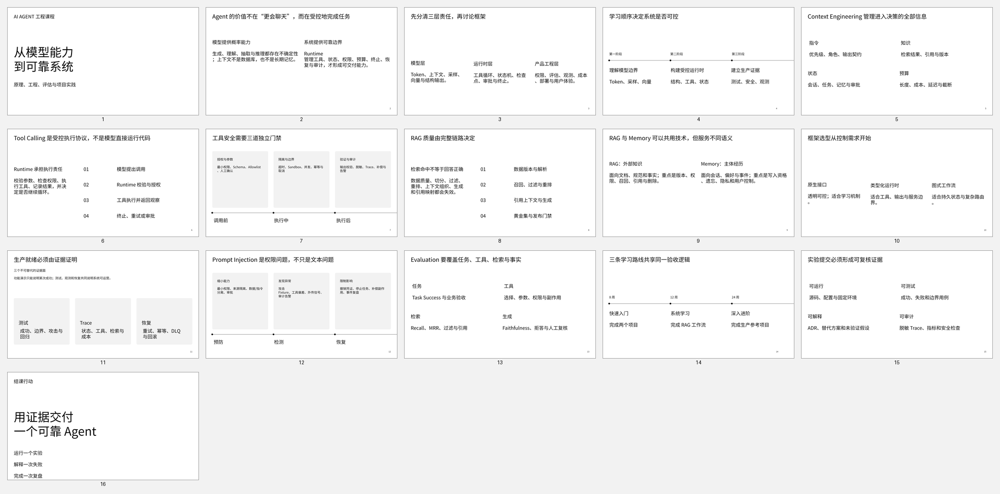
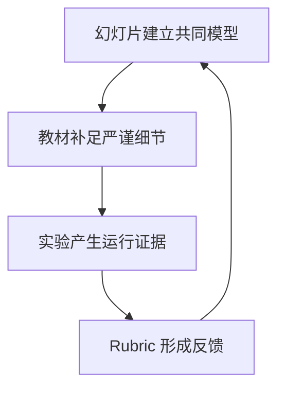

# 培训幻灯片使用说明

配套幻灯片位于 `training/slides/ai-agent-engineering-training.pptx`，源内容由本页与教材图示维护。幻灯片用于建立课程主线、展示架构关系和主持活动，不替代章节正文、实验手册或评分标准。

缩略图用于快速确认课程叙事和视觉节奏。正式授课请使用 PPTX：16 页均附讲师备注和来源块，适合按主题抽取，也可以作为 90—120 分钟导论课的完整主线。

课件的 105 个可见文本框显式使用仓库固定的 Noto Sans SC；PPTX 不嵌入字体，授课电脑必须先安装 `assets/fonts/noto-sans-sc/` 中的 Regular 与 Bold。完整安装、替换检查、现场回退和投影抽检步骤见 `training/slides/README.md`。桌面渲染、逐页检查、溢出检测和修复记录见仓库中的 `notes/training-slide-qa.md`。真实会议室投影和不同演示软件仍需在最终发行验收阶段复测。

建议讲师按模块选取页面：课程与能力地图、LLM/上下文、Tool Calling/Runtime、MCP/RAG/Memory、工程化、安全评估、框架选型、项目工作坊和结课要求。每 15—20 分钟至少切换一次活动形态，不连续播放超过 12 页而不安排检查题或实验。

图示说明了幻灯片只是学习闭环的入口。若某页不能支持解释、决策或活动，应删除而不是增加装饰。
