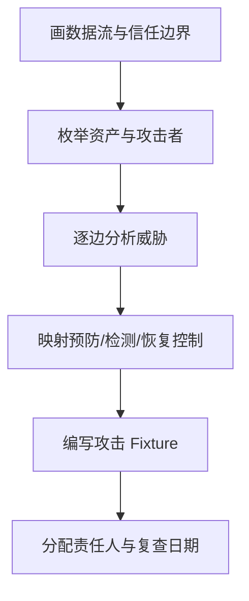

# 企业工作坊手册

## 工作坊一：Agent 架构评审

时长 120 分钟，输入为一个业务场景和当前架构草图，输出为两项 ADR 和风险清单。

| 时间 | 活动 | 输出 |
|---:|---|---|
| 0—15 分钟 | 明确用户、目标、非目标和 SLO | 一页问题声明 |
| 15—35 分钟 | 标注模型、Runtime、工具、状态和数据边界 | 上下文图 |
| 35—60 分钟 | 绘制成功与失败数据流 | 两张时序/流程图 |
| 60—80 分钟 | 比较普通代码、Workflow、单 Agent、多 Agent | 决策矩阵 |
| 80—105 分钟 | 审查恢复、权限、评估和成本 | 风险清单 |
| 105—120 分钟 | 形成决策 | ADR 与行动项 |

评审不接受“框架支持”作为架构理由，必须说明状态所有权、失败语义和可替代方案。

## 工作坊二：威胁建模

时长 90 分钟，使用数据流图识别 Prompt Injection、数据外传、工具滥用、过度代理和供应链风险。



每个威胁记录资产、入口、前置条件、影响、现有控制、缺口、测试方法和责任人。至少包含一次间接 Prompt Injection、一次跨租户访问和一次重复副作用攻击。

## 工作坊三：成本与容量估算

时长 90 分钟，输出月度成本模型、P95 延迟预算和降级策略。

```text
月成本 = 请求量 ×（输入 Token × 输入单价 + 输出 Token × 输出单价
         + 检索/重排 + 工具调用 + 存储与观测）
```

学员需要建立低、中、高三种流量情景，分别估算缓存命中、重试率、并行工具和长上下文影响。最终给出模型路由、上下文压缩、缓存、超时、预算拒绝和人工降级条件。价格数字必须标注来源和核对日期；离线课程使用变量或 Fixture，不硬编码易过时价格。

## 工作坊验收

产出必须由另一组使用 Rubric 评审。架构图没有失败路径、威胁没有测试方法、成本表没有流量假设或降级触发条件时，均不通过。

