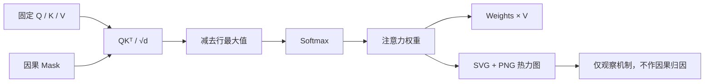
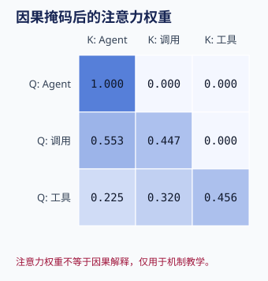

# Attention Mechanics Demo

本示例对应[第 3 章：Transformer 与 Attention](../../docs/part-01-foundations/ch03-transformer-attention.md)。它用固定 NumPy 数组实现缩放点积 Attention、因果 Mask 与多头形状变换，并生成 SVG/PNG 热力图。它不训练模型，也不把图中权重解释为最终输出的因果贡献。

## 架构与数据流



Softmax 前应用 Mask；全部被遮蔽的行会显式失败。`reshape_heads` 只演示 `[batch, sequence, model]` 到 `[batch, heads, sequence, head]` 的布局变化，不包含训练参数投影。

## 安装、运行与预期输出

```bash
cd examples/attention_demo
python3.12 -m venv .venv
.venv/bin/python -m pip install -e '.[test]'
.venv/bin/python -m attention_demo.main --output assets
```

命令输出 3×3 权重、每行和为 1 的校验值，以及 `assets/attention-weights.svg` 和 `assets/attention-weights.png`。固定 Fixture 的第一行只能看到第一个 Key，因此权重为 `[1.0, 0.0, 0.0]`。



## 测试、失败注入与调试

```bash
.venv/bin/python -m pytest -q
.venv/bin/ruff check src tests
.venv/bin/mypy src
```

成功路径验证输出形状、Softmax 行和、Mask 零权重和多头往返变形。失败路径覆盖 Q/K 维度不兼容、某行没有可见 Key，以及模型维度不能被头数整除。出现 `nan` 时应先检查是否整行 Mask、是否含非有限输入，以及是否在指数运算前减去行最大值。

## 安全边界与扩展

本示例没有网络、密钥或外部输入。若把可视化用于真实模型调试，日志仍可能泄漏输入 Token 或业务文本，应使用授权数据并限制产物访问。注意力图只反映某层某头的 Value 路由权重；残差、后续层与非线性仍会改变结果，因此必须结合受控扰动和任务指标。

扩展方向包括批次化多头 Attention、Padding Mask、数值梯度检查，以及在不改变输入的情况下比较不同 Head；深度学习框架版本应另建隔离示例。
