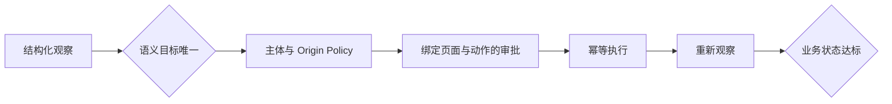

# Browser Safety Lab

本示例对应 [`docs/part-07-advanced/ch34-browser-computer-use.md`](../../docs/part-07-advanced/ch34-browser-computer-use.md)。它不启动真实浏览器，也不访问账号或网络，而是用确定性页面夹具验证 Browser Agent 最容易被“演示成功”掩盖的控制边界：语义目标唯一、外部写入审批、审批与页面快照绑定、动作后再观察、业务幂等，以及主体和 Origin Policy。



## 运行

```bash
cd examples/browser_safety_lab
python3.12 -m venv .venv
.venv/bin/python -m pip install -e '.[test]'
.venv/bin/python -m browser_safety_lab.main --fixture expense
.venv/bin/python -m pytest -q
```

预期依次得到 `approval_required`、`completed` 和 `duplicate_suppressed`。失败测试还覆盖重复语义元素、页面变更导致旧批准失效、驱动点击成功但业务状态未变化，以及跨主体/钓鱼 Origin 拒绝。

## 工程边界

`PagePort` 是 Playwright、WebDriver 或 Computer Use Adapter 的替换缝。生产适配器负责把 DOM、Accessibility Tree、截图和 URL 转成 `Observation`，但不能绕过 Runtime 的 Policy。真实系统还需要隔离浏览器 Profile、下载扫描、上传 Allowlist、凭证代理、超时、Trace 和人工恢复；本实验不声称验证具体浏览器驱动 API。
