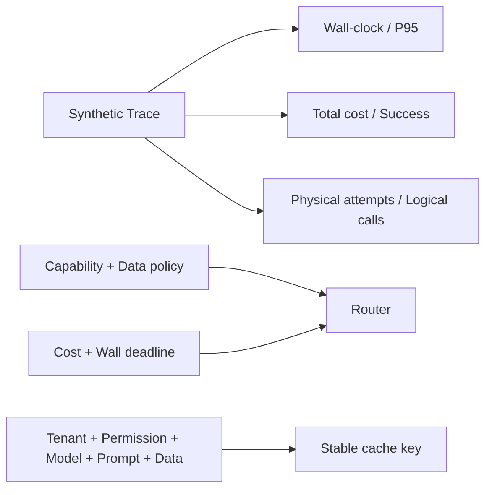

# Cost / Latency Lab

本示例对应[第 31 章：成本与性能优化](../../docs/part-05-engineering/ch31-cost-performance.md)。它不访问模型服务，也不写死任何供应商价格；合成 Trace 使用微成本单位和逻辑时间，验证墙钟关键路径、每成功任务成本、重试放大、租户隔离缓存键、模型路由和预算拒绝。

## 实验模型



并行 Span 的耗时不能相加：任务墙钟取最早开始到最晚结束。费用则对所有尝试求和，失败任务也消耗预算；因此单位成功任务成本是总费用除以成功任务数，而不是只统计成功请求的费用。

## 安装、运行和预期输出

```bash
cd examples/cost_latency_lab
python3.12 -m venv .venv
.venv/bin/python -m pip install -e '.[test]'
.venv/bin/python -m cost_latency_lab.main --fixture baseline
```

确定性 Fixture 应输出 `task_count=3`、`success_count=2`、`p95_wall_ms=250`、`total_cost_microunits=2550`、`cost_per_success_microunits=1275` 和 `retry_amplification=1.333...`。这些值只验证计算和控制逻辑，不代表任何真实模型的价格或性能。

## 测试与调试

```bash
.venv/bin/python -m pytest -q
.venv/bin/ruff check src tests
.venv/bin/mypy src tests
```

失败测试覆盖非法时间区间、零成功任务、能力预算不足和敏感数据模型策略。生产适配器应从 Trace/Usage 和带生效日期的价格目录生成 `TaskTrace`，同时记录未知费用而不是伪造为零。缓存键必须包含租户、权限、模型、Prompt、数据和请求版本；权限或数据版本变化会自然产生新键。

## 边界与扩展

最近秩 P95 适用于教学小样本，不替代生产直方图。真实负载还需区分队列、首 Token、Decode、工具、连接池与重试，并运行稳态、突发、浸泡和故障注入。扩展方向包括 OpenTelemetry Adapter、价格目录生效区间、置信路由校准、缓存失效事件和 HTML 性能报告。
