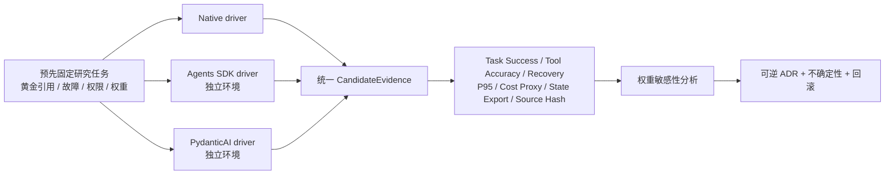

# Agent 框架同题证据对照

最后核对日期：2026-08-07。对应[第 38 章：技术选型指南](../../docs/part-07-advanced/ch38-selection-guide.md)。本示例不凭功能表给框架排名，而是让原生 Runtime、`openai-agents==0.18.3` 与 `pydantic-ai-slim==2.25.0` 在各自 Python 3.12 环境执行同一个离线研究任务，再对统一证据评分。

## 证据链



任务固定检索 `D1`、`D2` 两个来源；第一次搜索注入瞬时故障；`D-secret` 永远被租户 Policy 拒绝。三个候选都使用确定性模型或显式策略，因此这里比较的是运行时接线、恢复和证据可导出性，不比较在线模型的“聪明程度”。

## 默认离线运行

仓库提交了 2026-08-07 在隔离环境实际生成的 `fixtures/verified-evidence.json`。默认命令验证候选源码哈希、防止证据与实现漂移，然后评分：

```bash
cd examples/framework_comparison
python3.12 -m venv .venv
.venv/bin/python -m pip install -e '.[test]'
.venv/bin/python -m framework_comparison.main --fixture research
.venv/bin/python -m pytest -q
```

当前垂直切片选择原生 Runtime，只表示这个短、确定、无需持久 Checkpoint 的任务中，框架额外请求和接线没有产生净收益。它不是全书通用排名；一旦长任务恢复、Handoff、类型化依赖或框架 Trace 成为硬约束，就应重新执行 Spike。

## 重新生成真实证据

先分别安装 `examples/openai_agents_sdk/` 与 `examples/pydanticai_service/`，再显式提供各自解释器。候选不会被塞进同一个冲突环境：

```bash
export PYTHONPATH="$PWD/src"
export FRAMEWORK_COMPARISON_OPENAI_PYTHON=/path/to/openai-sdk-venv/bin/python
export FRAMEWORK_COMPARISON_PYDANTICAI_PYTHON=/path/to/pydanticai-venv/bin/python
python -m framework_comparison.main --fixture research --regenerate --runs 20 --write
```

该命令重写 `fixtures/verified-evidence.json` 与 `ADR.md`。证据包含版本、Python 版本、20 次运行的 P95、工具事件、任务结果、成本代理、可导出状态和候选源码 SHA-256。真实 Provider 延迟、质量和价格不在本基准中，不能从本地 P95 推断线上性能。

## 评分与回滚边界

权重在实现前固定于 `fixtures/research-spec.json`。本地运行时开销低于 50 ms 均视为满足预算，避免亚毫秒 Native 调用把网络场景中的无意义差距放大。敏感性分析逐项上下调整 20%；若赢家变化，ADR 必须标记选择不稳健。

回滚不是卸载依赖：领域 `ResearchReport`、Tool Event 与导出状态由本工程拥有；切换时停止接收新 Run，让旧 Adapter 排空，再把新 Run 切到上一 Adapter并重放黄金基准。`ADR.md` 明确记录不确定性与重新评估触发条件。
