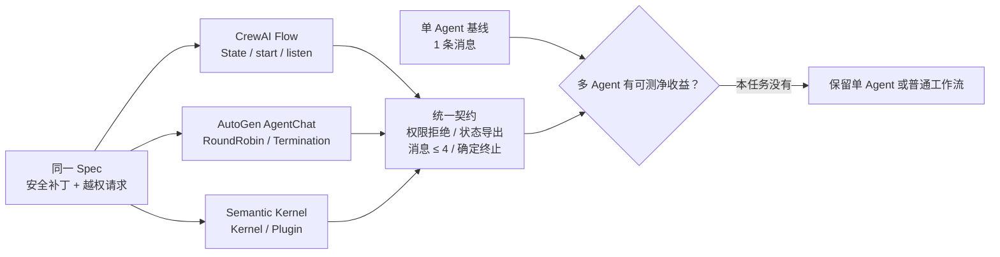

# 受限 Reviewer/Executor 同题实测

最后核对日期：2026-08-07。三个候选分别安装在独立 Python 3.12 环境，执行同一个离线任务：Executor 只能修改 `src/app.py`，对 `read_secret` 的请求必须拒绝；Reviewer 决定批准或退回；运行时最多允许四条角色消息。



图中“通过契约”只说明接线正确，不说明多 Agent 优于单 Agent。当前任务的单 Agent 基线用一条消息完成，三个协作实现都需要两条；独立 Reviewer 增加了职责隔离，但 Fixture 没有测出成功率收益，所以不能据此推荐 Multi-Agent。

## 固定版本与验证边界

| 候选 | 固定版本 | 实际使用的框架原语 | 边界 |
|---|---:|---|---|
| CrewAI | 1.15.12 | `Flow`、类型化 State、`start`、`listen` | 确定性 Flow，不调用 Crew/LLM |
| AutoGen AgentChat | 0.7.5 | `BaseChatAgent`、`RoundRobinGroupChat`、组合终止条件、Team State | 原生两 Agent Team，确定性 Agent，不调用模型 |
| Semantic Kernel | 1.44.1 | `Kernel`、`kernel_function`、Plugin 调用 | 受限 Runner 编排两个 Plugin；未声称验证原生 Agent Orchestration |

`evidence.json` 保存稳定摘要和实现 SHA-256；它不保存 AutoGen 的随机消息 ID 和时间戳。每个候选还测试强制不批准路径，必须以 `budget_exhausted` 结束，不允许无限对话。

## 运行

每个目录必须使用自己的环境，不能把三套依赖塞进根环境：

```bash
python3.12 -m venv /tmp/agent-book-crewai
/tmp/agent-book-crewai/bin/pip install -e './crewai[test]'
PYTHONPATH=crewai /tmp/agent-book-crewai/bin/pytest -q crewai/tests

python3.12 -m venv /tmp/agent-book-autogen
/tmp/agent-book-autogen/bin/pip install -e './autogen[test]'
PYTHONPATH=autogen /tmp/agent-book-autogen/bin/pytest -q autogen/tests

python3.12 -m venv /tmp/agent-book-sk
/tmp/agent-book-sk/bin/pip install -e './semantic_kernel[test]'
PYTHONPATH=semantic_kernel /tmp/agent-book-sk/bin/pytest -q semantic_kernel/tests
```

各候选均有两项直接测试：批准路径验证 Tool Policy 与状态导出，拒绝路径验证消息预算和终止原因。在线模型质量、真实 Token 成本、分布式 Runtime 和恢复式持久化不在本次证据范围内。
