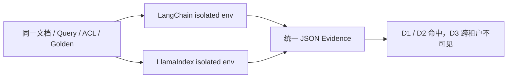

# LangChain 与 LlamaIndex 同题 RAG Spike

核对日期：2026-08-07。候选固定为 LangChain 1.3.14（运行时 core 1.5.3）与 LlamaIndex Core 0.14.23。两者读取同一 `spec.json`，使用相同的确定性八维 Embedding、租户过滤和 0.1 相关性阈值；默认不连接模型或付费服务。



图中的 Q3 很关键：查询与 beta 租户秘密文档高度相关，但 alpha 主体不能召回 D3；剩余 alpha 文档与查询相似度为零，因此还必须经过阈值拒绝，不能为了“总有答案”而生成错误引用。

## 运行

```bash
python3.12 -m venv /tmp/rag-langchain
/tmp/rag-langchain/bin/python -m pip install -e 'langchain[test]'

python3.12 -m venv /tmp/rag-llamaindex
/tmp/rag-llamaindex/bin/python -m pip install -e 'llamaindex[test]'

python3.12 run.py \
  --langchain-python /tmp/rag-langchain/bin/python \
  --llamaindex-python /tmp/rag-llamaindex/bin/python
```

`evidence.json` 保存 Fixture 与实现源码 SHA-256，避免代码改变后仍引用旧结果。本 Spike 只证明离线向量检索、Metadata ACL 和拒答阈值，不评价真实 Embedding、生成质量、外部 Vector Store、网络延迟或运维成本。

对应章节：[`docs/part-04-frameworks/ch21-langchain-llamaindex.md`](../../../docs/part-04-frameworks/ch21-langchain-llamaindex.md) 与 [`docs/part-07-advanced/ch38-selection-guide.md`](../../../docs/part-07-advanced/ch38-selection-guide.md)。

