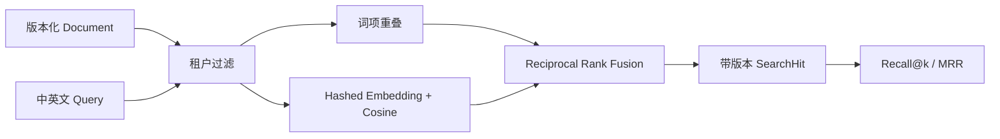

# Local Semantic Search

本示例对应[第 5 章：Embedding 与语义表示](../../docs/part-01-foundations/ch05-embedding.md)。它用版本化文档构建本地稀疏检索、确定性 Hash 向量检索与 RRF Hybrid Search，并对中英文固定查询集计算 Recall@k 和 MRR。Hash Fixture 只是离线替身，不具备训练语义模型的泛化能力。

## 架构、权限与数据流



权限过滤在候选生成前完成，未授权文档不会进入应用可见的候选列表、分数或 Trace。更新同一文档必须递增版本；旧 Chunk 被替换，命中结果始终携带版本。

## 安装、运行与预期输出

```bash
cd examples/local_semantic_search
python3.12 -m venv .venv
.venv/bin/python -m pip install -e '.[test]'
.venv/bin/python -m local_semantic_search.main --fixture bilingual
```

固定查询 `context budget 上下文预算` 的首个 RRF 命中应为 `context-budget`。三条黄金查询的离线报告应为 `Recall@3 = 1.0`、`MRR = 1.0`。这些数字只证明 Fixture 与索引控制流可重复，不能作为真实 Embedding 模型选型依据。

## 测试、失败注入与调试

```bash
.venv/bin/python -m pytest -q
.venv/bin/ruff check src tests
.venv/bin/mypy src tests
```

测试分别验证 sparse、dense、RRF、文档版本替换、维度不匹配、跨租户拒绝与 Recall/MRR。若 Dense 排名异常，先检查 Embedding 版本与维度，再检查向量范数、Chunk 文本和 ACL；若 Hybrid 变差，应保存两路候选与 RRF 排名做消融，而不是随意提高 top-k。

## 在线替代、安全与扩展

真实模型接入应实现 `EmbeddingProvider`，固定模型与维度，并为全量重嵌入建立双写或版本迁移。模型升级时不得把不同空间的向量混入同一索引。查询和文档可能含个人数据，外部 Embedding 服务需经过数据出境与保留策略审查。

扩展方向包括 BM25、父子 Chunk、元数据过滤、Reranker、删除 Tombstone，以及用真实标注集比较稀疏、稠密和 Hybrid 的质量、P95 延迟与成本。
