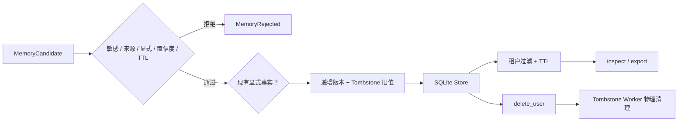

# Governed Long-term Memory

本示例对应[第 15 章：Memory](../../docs/part-03-rag-and-memory/ch15-memory.md)。它使用 SQLite、Fake Clock 和显式写入门禁实现来源、显式/推断冲突、TTL、更正、用户查看/导出/删除、Tombstone 清理和租户隔离。

## 记忆生命周期



明确的用户更正可以覆盖旧推断；模型推断不能覆盖明确事实。审计事件只保存 ID、Key、事件和数量，不保存已删除的 Value。

## 安装、运行与预期输出

```bash
cd examples/long_term_memory
python3.12 -m venv .venv
.venv/bin/python -m pip install -e '.[test]'
.venv/bin/python -m long_term_memory.main --fixture preferences --action inspect
.venv/bin/python -m long_term_memory.main --fixture preferences --action export
.venv/bin/python -m long_term_memory.main --fixture preferences --action delete
```

Inspect 输出带来源、版本和过期时间的记录；Export 输出 `{"python_version": "3.12"}`；Delete 输出物理清理数量和不含 Value 的审计事件。

## 测试、失败注入与调试

```bash
.venv/bin/python -m pytest -q
.venv/bin/ruff check src tests
.venv/bin/mypy src tests
```

测试覆盖写入门禁、来源、显式/推断优先级、TTL、用户更正、删除传播、审计脱敏和跨租户拒绝。Fake Clock 使过期测试不依赖真实等待。

## 安全边界与扩展

正则敏感检测只是教学门禁，SQLite 文件也没有字段级加密。生产环境需使用租户行级策略、密钥管理、保留计划、备份删除传播、访问审计和用户同意。长期记忆不应自动保存密码、令牌、健康信息或未经确认的模型推断。扩展方向包括加密字段、异步删除队列、向量检索、冲突 UI 和数据主体请求 SLA。
