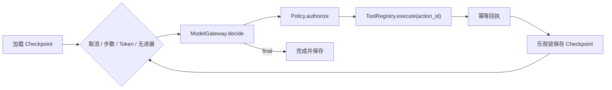

# Minimal Recoverable Agent

本示例对应[第 9 章：Agent Runtime](../../docs/part-02-agent-core/ch09-agent-runtime.md)和[第 17 章：原生 API 构建 Agent](../../docs/part-04-frameworks/ch17-native-api.md)。它把 ModelGateway、ToolRegistry、StateStore、Policy、Tracer 与 TerminationPolicy 作为显式端口，并用离线适配器验证恢复语义。

## Runtime 与恢复协议



`action_id` 由 run、步骤、工具和规范化参数生成。若 Worker 在工具确认后、Checkpoint 保存前崩溃，恢复会再次提出相同动作，但 Tool Adapter 返回已有回执，不重复外部副作用。

## 安装、运行与预期输出

```bash
cd examples/minimal_agent
python3.12 -m venv .venv
.venv/bin/python -m pip install -e '.[test]'
.venv/bin/python -m minimal_agent.main --fixture recoverable
```

预期状态为 `completed`，答案为 `budget is 16`，工具副作用次数为 1。Fixture 完全离线，不调用模型服务。

## 测试、失败注入与调试

```bash
.venv/bin/python -m pytest -q
.venv/bin/ruff check src tests
.venv/bin/mypy src tests
```

测试覆盖直接回答、工具 Observation、未知工具、超时、无进展、取消、Token 预算和崩溃恢复。恢复测试故意在确认工具结果后抛出进程错误，再创建新的 Runtime；断言同一 `action_id` 不会使副作用计数增加。

## 安全边界与扩展

Policy 和 TerminationPolicy 是模型不可修改的控制数据。Trace 只记录 run、工具名和 action ID，不记录 Prompt、参数或工具结果正文。内存 Store 与 Fake Tool 只适合教学；生产实现需要事务 Checkpoint、Outbox/幂等表、租户隔离、密钥分离、截止时间和取消传播。扩展方向包括流式事件、CAS 冲突重试、人工审批与未确认副作用的状态核实。
