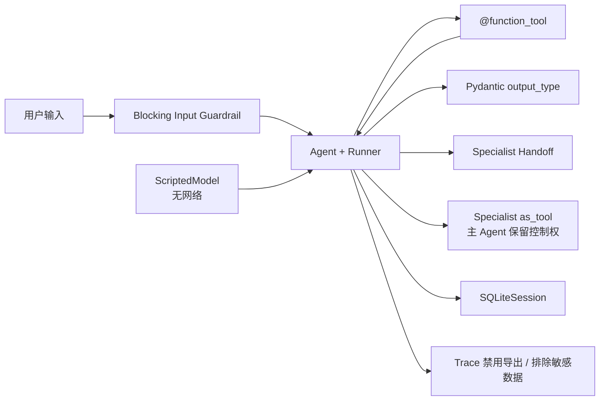

# OpenAI Agents SDK 0.18.3 实测示例

最后核对日期：2026-08-07。对应[第 18 章：OpenAI Agents SDK](../../docs/part-04-frameworks/ch18-openai-agents-sdk.md)。本工程固定并实际安装 `openai-agents==0.18.3`，使用实现 SDK `Model` 接口的 ScriptedModel 离线验证 Runner、Function Tool、结构化输出、Handoff、Agent-as-tool、阻塞 Guardrail、SQLiteSession 和安全 Trace 配置。

## 架构与运行边界



离线 Fake 只模拟 SDK 所需的 Responses 输出项，不模拟模型推理。默认运行不读取 API Key、不访问网络、不上传 Trace。

## 安装、运行与预期输出

```bash
cd examples/openai_agents_sdk
python3.12 -m venv .venv
.venv/bin/python -m pip install -e '.[test]'
OPENAI_AGENTS_DISABLE_TRACING=1 .venv/bin/python -m openai_agents_sdk_example.main --offline
```

预期输出是 `summary=ticket resolved`、`risk=low` 的结构化 JSON。当前环境存在 SOCKS 代理，因此显式固定 `httpx[socks]`，避免 SDK 初始化 Trace HTTP Client 时因缺少 `socksio` 失败。

## 测试与故障边界

```bash
OPENAI_AGENTS_DISABLE_TRACING=1 .venv/bin/python -m pytest -q
.venv/bin/python -m ruff check src tests
```

测试证明工具调用项和输出项进入 RunResult、Handoff 转移到 Specialist、Agent-as-tool 调用专家后仍由 Orchestrator 收口、SQLiteSession 保存会话，以及 `run_in_parallel=False` 的阻塞 Guardrail 在模型执行前触发。测试不需要付费账号。

## 安全、在线模式与版本证据

在线模式应另加预算受限的 Smoke Test，从环境读取 `OPENAI_API_KEY`，并明确模型、最大轮数和 Trace 数据策略。本示例不默认提供在线命令，以免 CI 意外计费。Guardrail 不能替代工具权限，Session 也不等于长期 Memory。

版本证据来自 2026-08-07 的隔离安装与包自省；官方资料包括 [Agents SDK 首页](https://openai.github.io/openai-agents-python/)、[Agents](https://openai.github.io/openai-agents-python/agents/)、[Running agents](https://openai.github.io/openai-agents-python/running_agents/)、[Guardrails](https://openai.github.io/openai-agents-python/guardrails/)、[Handoffs](https://openai.github.io/openai-agents-python/handoffs/)和[Tracing](https://openai.github.io/openai-agents-python/tracing/)。
