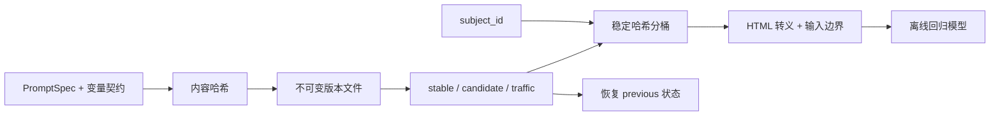

# Prompt Registry

本示例对应[第 6 章：Prompt Engineering](../../docs/part-02-agent-core/ch06-prompt-engineering.md)。它提供不可变 Prompt 版本、SHA-256 内容哈希、严格变量渲染、稳定灰度分桶、回滚和确定性回归 Fake。

## 架构与发布流



模板只允许简单标识符字段，拒绝属性与索引访问。变量集合必须与声明完全一致，值经过 HTML 转义并包在 `<input>` 数据边界中；这能减少意外插值，但不能单独解决 Prompt Injection。

## 安装、运行与预期输出

```bash
cd examples/prompt_registry
python3.12 -m venv .venv
.venv/bin/python -m pip install -e '.[test]'
.venv/bin/python -m prompt_registry.main --fixture support
```

输出包含灰度选中的版本、结构化分类结果，以及回滚后的 `1.0.0`。离线 Fake 对等价版本返回相同结果，使模板回归不依赖付费 API。

## 测试与失败注入

```bash
.venv/bin/python -m pytest -q
.venv/bin/ruff check src tests
.venv/bin/mypy src tests
```

测试覆盖不可变发布、内容哈希、变量缺失/多余、不安全字段、稳定分桶、灰度和回滚。生产实现还应使用原子写入或事务存储、操作者身份、审批记录与部署审计；本示例的单进程文件存储不适合并发多副本服务。

## 安全边界与扩展

Prompt 文件不得包含密钥或真实个人数据。回归 Trace 建议记录版本与哈希，不记录完整敏感输入。灰度键应选稳定且合规的主体 ID 哈希，不能按敏感属性歧视性路由。扩展方向包括签名制品、双人审批、结构化评估集、发布阈值和跨环境晋级。
