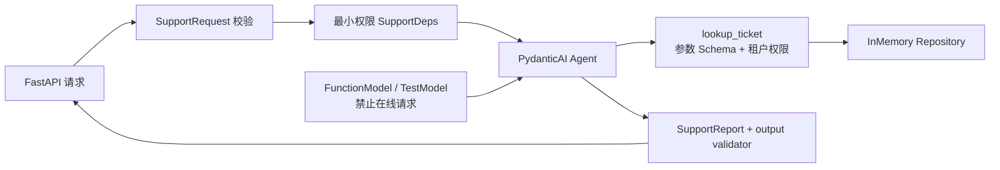

# PydanticAI 2.25.0 + FastAPI 实测服务

最后核对日期：2026-08-07。对应[第 19 章：PydanticAI](../../docs/part-04-frameworks/ch19-pydanticai.md)。本示例在 Python 3.12 隔离环境固定 `pydantic-ai-slim==2.25.0` 与 `fastapi==0.116.1`，使用官方 `FunctionModel`、`TestModel` 和 `Agent.override` 离线验证类型化依赖、工具参数校验、输出业务校验、有限重试和 HTTP 错误映射。

## 请求链路



类型注解约束工具和输出的形状，租户隔离仍由 Repository 执行。`models.ALLOW_MODEL_REQUESTS=False` 防止测试误发在线请求，离线模型只是确定性协议 Fixture，不代表真实模型质量。

## 安装、运行与测试

```bash
cd examples/pydanticai_service
python3.12 -m venv .venv
.venv/bin/python -m pip install -e '.[test]'
.venv/bin/python -m pydanticai_service.main --offline
.venv/bin/python -m pytest -q
.venv/bin/python -m ruff check src tests
.venv/bin/python -m mypy src tests
```

入口应输出 `T-42` 的结构化已解决报告。测试覆盖依赖注入、精确 Tool Call、官方 TestModel、FastAPI ASGI 请求、工具 Schema 重试、输出 validator 重试、重试耗尽、权限拒绝和依赖故障。默认不读取 API Key，也不访问网络。

## 边界与在线扩展

在线适配器必须作为显式可选依赖增加，并设置模型、总请求预算、超时、供应商重试和敏感 Trace 策略。本示例固定 slim 包，因为教学路径不需要同时安装所有供应商、CLI、MCP 和评估附加项。错误响应稳定为 `policy_denied`、`dependency_unavailable`、`invalid_agent_result` 或 `timeout`；框架异常栈不暴露给客户端。

官方资料：[Dependencies](https://pydantic.dev/docs/ai/core-concepts/dependencies/)、[Tools](https://pydantic.dev/docs/ai/tools-toolsets/tools/)、[Output](https://pydantic.dev/docs/ai/core-concepts/output/)与[Testing](https://pydantic.dev/docs/ai/guides/testing/)。
