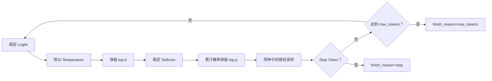

# Sampling Lab

本示例对应[第 4 章：LLM 生成机制](../../docs/part-01-foundations/ch04-generation.md)。它对一个四项玩具词表应用 Temperature、top-k、top-p、带种子的随机采样、Stop Token 和最大输出长度。固定 Logit Provider 不是语言模型，实验只用于隔离并理解解码参数。

## 数据流与过滤顺序



示例明确规定过滤顺序，避免把不同实现的结果直接比较。真实供应商可能不暴露 top-k，或对 Stop Sequence、种子和推理模型采用不同约束，必须以对应版本文档为准。

## 安装、运行与预期输出

```bash
cd examples/sampling_lab
python3.12 -m venv .venv
.venv/bin/python -m pip install -e '.[test]'
.venv/bin/python -m sampling_lab.main --seed 2026 --output assets
```

命令打印固定种子的 Token 序列和 `finish_reason`，并生成 `assets/sampling-comparison.csv` 与 `assets/sampling-comparison.md`。报告对种子 0—499 重复实验，比较基线、低温 top-k 与 nucleus 三种配置的经验频率；同一 Python 3.12 实现重复运行结果一致。

## 测试、失败注入与调试

```bash
.venv/bin/python -m pytest -q
.venv/bin/ruff check src tests
.venv/bin/mypy src tests
```

测试覆盖分布归一化、top-k/top-p 联合过滤、固定种子、Stop Token 与最大长度。失败路径覆盖非正 Temperature、越界 top-p、非正 top-k、空或非有限 Logits，以及非正最大输出长度。若结果看似“温度无效”，先检查候选是否已经被 top-k/top-p 收缩为单项，再检查是否错误复用了同一个随机状态。

## 安全边界与扩展

离线示例不联网、不读取密钥，也不声称经验频率代表语言质量。固定种子提高回归可重复性，却不保证不同供应商、硬件或服务版本逐 Token 一致。生产系统还应记录模型快照、参数、finish reason 与 Usage，并对输出执行 Schema 和内容校验。

扩展方向包括 Stop 字符串跨 Token 匹配、重复惩罚、批量采样，以及将供应商返回分布接入同一报告；若平台不提供 Logprobs，就不能伪造概率曲线。
