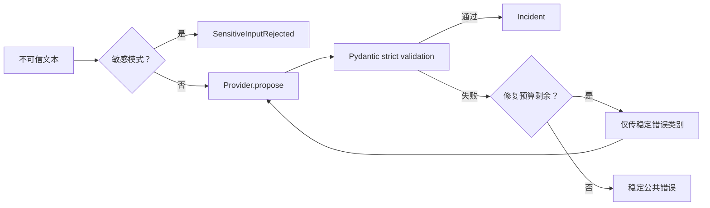

# Structured Extractor

本示例对应[第 7 章：Structured Output](../../docs/part-02-agent-core/ch07-structured-output.md)。它用 Pydantic 2.11.7 定义事故 Schema，把 Provider 输出校验、有限修复、敏感输入门禁和稳定公共错误分开。

## 数据流与失败边界



内部校验详情可以进入受控 Trace，但不会原样返回给不可信调用方。修复最多三次，默认一次；每次重试都计入总预算。

## 安装、运行与预期输出

```bash
cd examples/structured_extractor
python3.12 -m venv .venv
.venv/bin/python -m pip install -e '.[test]'
.venv/bin/python -m structured_extractor.main --fixture incident
```

预期输出为 `title=支付超时`、`severity=high`、`affected_service=payment` 的 JSON。默认 Provider 是确定性 Fake，不联网。

## 测试、失败注入与调试

```bash
.venv/bin/python -m pytest -q
.venv/bin/ruff check src tests
.venv/bin/mypy src tests
```

测试覆盖有效抽取、缺字段、错误类型、空字段、一次修复成功、修复预算耗尽和敏感数据拒绝。调试时应区分 Provider 超时、JSON 解析失败、Schema 校验失败和业务校验失败；不要用无界重试掩盖持续性错误。

## 安全边界与扩展

正则敏感门禁只是教学策略，无法替代企业 DLP。线上 Adapter 必须从环境读取密钥、设置超时、限制输入长度，并对日志脱敏。结构有效不代表事实正确；重要字段仍需来源引用或业务系统核验。扩展方向包括部分解析状态、字段级来源、异步 Provider、MockTransport 和发布回归集。
