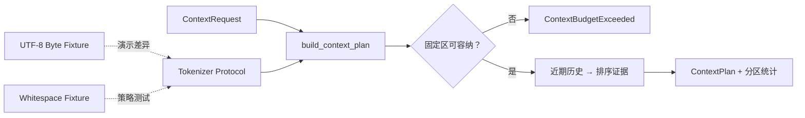

# Token Counter 与上下文预算器

本示例对应[第 2 章：Token、Tokenizer 与上下文窗口](../../docs/part-01-foundations/ch02-token-and-context.md)。它演示多语言文本在一个确定性计数规则下的差异，并把固定上下文、近期历史、检索证据与输出预留量纳入同一预算。Fixture Tokenizer 只验证控制逻辑，不能用于真实模型计费或临界窗口判断。

## 架构与数据流



领域层只依赖 `Tokenizer` 协议。`max_history_tokens` 与 `max_evidence_tokens` 为弹性区域设置显式上限，避免某一类内容占满剩余窗口；未设置时才按可用余量选择。生产适配器应由目标模型官方 Tokenizer 实现；本工程没有安装或猜测任何供应商 Tokenizer API。

## 安装与离线运行

```bash
cd examples/token_counter
python3.12 -m venv .venv
.venv/bin/python -m pip install -e '.[test]'
.venv/bin/python -m token_counter.main --fixture multilingual
```

预期输出中的核心字段如下；JSON 还会列出被选择的历史与证据：

```json
{
  "fixture_counts": {"english": 5, "chinese": 9, "emoji": 4},
  "context_plan": {
    "model_window": 16,
    "partition_tokens": {
      "fixed": 6,
      "history": 2,
      "evidence": 2,
      "output_reserved": 4,
      "unused": 2
    }
  }
}
```

## 测试与失败注入

```bash
.venv/bin/python -m pytest -q
.venv/bin/ruff check src tests
.venv/bin/mypy src
```

`test_failures.py` 将固定上下文和输出预留量构造成不可容纳请求，验证程序显式抛出 `ContextBudgetExceeded`，而不是静默删除安全指令。还覆盖零窗口、负窗口、无输出预留和预留量超过窗口等边界。

## 在线扩展与安全边界

接入真实模型时，应新增实现 `Tokenizer` 协议的独立 Adapter，并固定已验证版本。调用前使用匹配的 Tokenizer 预估，调用后用供应商 Usage 校准；二者持续偏离时应报警。不要把提示词正文、密钥或个人数据写入 Token 统计日志，建议只记录分区计数、来源 ID、Tokenizer 版本和截断原因。

扩展方向包括聊天协议封装开销、工具调用消息计数、按分区上限分配预算，以及对 P50/P95 请求长度的容量报告。
