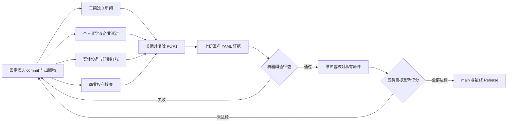

# P9 外部验收执行包

本目录把 P9 尚未完成的真人门禁转换为可执行、可追溯、可复验的证据流程。它不包含虚构的通过记录；`evidence/` 在真实活动完成前只保留说明文件。

当前冻结候选为 [`p9-candidate-034ac18`](https://github.com/wujinjun/ai-agent-book/releases/tag/p9-candidate-034ac18)，对应 commit `034ac18e2f675aa2b73dcfcf83d23b0717b63656`。Release 附件 `external-validation-kit-034ac18.zip` 的 SHA-256 为 `227c064f11ee9596be7ef800caf2efe571836b8c1d779335c0255af3008ecc02`。它是预发布验收材料，不表示任何外部活动已经通过。

参与者可在 [P9 外部验收跟踪 Issue #1](https://github.com/wujinjun/ai-agent-book/issues/1) 认领角色和报告进度。Issue 只用于公开协调；姓名、联系方式、签字件、原始测评数据、合同和法律意见仍须保存在受控渠道。



图中的机器检查只负责结构、阈值和一致性；独立性、活动真实性和私有原件仍由维护者与发行主体核对。

## 需要提交的七份记录

| 证据 | 数量 | 通过条件摘要 | 执行说明 |
|---|---:|---|---|
| 独立 Agent 工程审阅 | 1 | 独立、结论通过、P0/P1 为 0 | [技术与编辑审阅包](independent-review-packet.md) |
| 独立 Python 工程审阅 | 1 | 独立、结论通过、P0/P1 为 0 | [技术与编辑审阅包](independent-review-packet.md) |
| 独立中文技术编辑审阅 | 1 | 独立、结论通过、P0/P1 为 0 | [技术与编辑审阅包](independent-review-packet.md) |
| 个人学习试验 | 1 | 至少 3 人，达到时间、独立完成率和得分阈值 | [`training/p9-trial-protocol.md`](../training/p9-trial-protocol.md) |
| 企业培训试讲 | 1 | 6—12 人，环境、实验、前后测和仓库独立授课达标 | [`training/p9-trial-protocol.md`](../training/p9-trial-protocol.md) |
| 实体设备与印刷 | 1 | iPhone、iPad、Android 实机和印刷样张通过 | [设备与印刷协议](device-print-protocol.md) |
| 商业权利核查 | 1 | 独立专业核查、八类权利范围完整、无开放条件 | [权利核查协议](rights-review-protocol.md) |

每份记录必须引用同一个已冻结候选的 40 位 Git commit 和同一份候选清单 SHA-256。证据随后才写入仓库，因此不能要求 `source_commit` 等于包含证据文件的标签 commit；那会形成 Git 哈希自引用。最终门禁改为验证候选是标签的祖先，并拒绝候选之后对教材正文、项目、测试或构建代码的任何修改。Reviewer 的姓名、公司邮箱、电话、签字件和法律意见正文保存在受控系统；仓库只提交匿名 `reviewer_id`、不含个人信息的汇总指标和私有原件引用或哈希。

## 使用方法

1. 提交并推送全部候选内容，确认工作区干净。构建发布包和外部验收执行包；两个工具都会拒绝未提交或未跟踪文件，执行包还会再次核对候选 commit、文件大小和 SHA-256：

   ```bash
   test -z "$(git status --porcelain)"
   candidate_commit="$(git rev-parse HEAD)"
   .venv/bin/python scripts/package_release.py \
     --version p9-candidate \
     --destination output/release-p9-candidate
   .venv/bin/python scripts/prepare_external_validation_kit.py \
     output/release-p9-candidate/RELEASE_MANIFEST-p9-candidate.json
   ```

   分发 `output/external-validation-kit.zip`。其中包含可直接打开的 HTML 完整包、PDF、EPUB、培训 PPTX、发行说明、五份执行协议、候选清单、校验文件、执行包文件清单，以及七份已绑定 commit/清单哈希但仍默认失败的 YAML。

2. 审阅者在执行包内填写记录并交回匿名 YAML。维护者核对私有原件后，把执行包的 `candidate/release-manifest.json` 复制到仓库同名目录，并把七份 YAML 放入 `evidence/`；不要提交整套产物或任何身份信息。
3. 完成活动后填写汇总值，所有 P0/P1 问题关闭并在私有原件中保留复验记录。若修复正文、代码或构建工具，必须重新冻结候选、重新打包并重新取得受影响证据。
4. 执行局部检查：

   ```bash
   .venv/bin/python scripts/validate_external_evidence.py external-validation/evidence --allow-partial
   ```

   局部检查的 `structurally_valid=True` 只说明当前已提交记录没有结构或阈值错误；在七份记录齐全前，输出必须同时显示 `complete=False`，不得把它表述为 P9 通过。

5. 七份证据齐全后，对固定候选执行最终检查：

   ```bash
   .venv/bin/python scripts/validate_external_evidence.py \
     external-validation/evidence \
     --expected-source-commit "$candidate_commit"
   ```

6. 核对候选包和执行包的文件校验和：

   ```bash
   python -m json.tool \
     output/release-p9-candidate/RELEASE_MANIFEST-p9-candidate.json
   cd output/release-p9-candidate && shasum -a 256 -c SHA256SUMS-p9-candidate.txt
   ```

7. 验证器通过并不自动关闭 P9。维护者核对私有原件后，只能提交证据、冻结清单和规定的最终状态文件，再更新 `notes/p9-acceptance.yml` 与五类得分。版本标签工作流会验证候选祖先关系、最终化差异白名单、完整证据和 `audit_final_acceptance.py --require-complete`；普通分支仍允许保留部分证据。

## 证据边界

- `private_source_reference` 或 `private_opinion_reference` 只保存受控系统编号、不可逆哈希或访问受限的档案引用，不提交原始身份信息。
- 自动验证器检查结构和阈值，不判断外部记录是否伪造。维护者必须比对原件、活动日期、目标 commit 和问题关闭证据。
- 候选到最终标签之间允许修改的路径由验证器固定；若出现章节、项目、测试、依赖或构建代码变化，必须产生新候选并重新执行相应外部验收。
- 同一人不得同时充当仓库维护者角色复审和对应独立外审；利益冲突声明必须留档。
- 失败记录可以保留在私有工作区用于改进，但只有关闭 P0/P1 并复验通过的最终汇总进入仓库。
