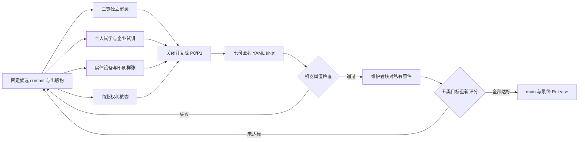

# P9 外部验收执行包

本目录把 P9 尚未完成的真人门禁转换为可执行、可追溯、可复验的证据流程。它不包含虚构的通过记录；`evidence/` 在真实活动完成前只保留说明文件。



图中的机器检查只负责结构、阈值和一致性；独立性、活动真实性和私有原件仍由维护者与发行主体核对。

## 需要提交的七份记录

| 证据 | 数量 | 通过条件摘要 | 执行说明 |
|---|---:|---|---|
| 独立 Agent 工程审阅 | 1 | 独立、结论通过、P0/P1 为 0 | [技术与编辑审阅包](independent-review-packet.md) |
| 独立 Python 工程审阅 | 1 | 独立、结论通过、P0/P1 为 0 | [技术与编辑审阅包](independent-review-packet.md) |
| 独立中文技术编辑审阅 | 1 | 独立、结论通过、P0/P1 为 0 | [技术与编辑审阅包](independent-review-packet.md) |
| 个人学习试验 | 1 | 至少 3 人，达到时间、独立完成率和得分阈值 | [`training/p9-trial-protocol.md`](../training/p9-trial-protocol.md) |
| 企业培训试讲 | 1 | 6—12 人，环境、实验、前后测和仓库独立授课达标 | [`training/p9-trial-protocol.md`](../training/p9-trial-protocol.md) |
| 实体设备与印刷 | 1 | iPhone、iPad、Android 实机和印刷样张通过 | [设备与印刷协议](device-print-protocol.md) |
| 商业权利核查 | 1 | 独立专业核查、八类权利范围完整、无开放条件 | [权利核查协议](rights-review-protocol.md) |

每份记录必须引用其核验的 40 位 Git commit。最终标签的发布门禁会把七份记录的 `source_commit` 与标签所指向的 `GITHUB_SHA` 比较；证据来自其他提交时，Release 会拒绝创建。Reviewer 的姓名、公司邮箱、电话、签字件和法律意见正文保存在受控系统；仓库只提交匿名 `reviewer_id`、不含个人信息的汇总指标和私有原件引用或哈希。

## 使用方法

1. 从 [`templates/`](templates/) 复制对应 YAML 到 `evidence/`，改名为不含姓名的稳定记录 ID。
2. 完成活动后填写汇总值，所有 P0/P1 问题关闭并在私有原件中保留复验记录。
3. 执行局部检查：

   ```bash
   .venv/bin/python scripts/validate_external_evidence.py external-validation/evidence --allow-partial
   ```

4. 七份证据齐全后，对固定候选 commit 执行最终检查：

   ```bash
   candidate_commit="$(git rev-parse HEAD)"
   .venv/bin/python scripts/validate_external_evidence.py \
     external-validation/evidence \
     --expected-source-commit "$candidate_commit"
   ```

5. 构建发布候选并检查 `RELEASE_MANIFEST-<版本>.json`。该清单固定候选 commit，并记录 PDF、EPUB、培训 PPTX 和发行说明的文件名、大小与 SHA-256：

   ```bash
   .venv/bin/python scripts/package_release.py --version v2026.x.y
   python -m json.tool output/release/RELEASE_MANIFEST-v2026.x.y.json
   cd output/release && shasum -a 256 -c SHA256SUMS-v2026.x.y.txt
   ```

6. 验证器通过并不自动关闭 P9。维护者还必须核对私有原件、更新 `notes/p9-acceptance.yml`、重新计算五类目标分，并验证 main 与最终 GitHub Release。版本标签工作流还会强制执行完整证据校验和 `audit_final_acceptance.py --require-complete`；普通分支仍允许保留部分证据。

## 证据边界

- `private_source_reference` 或 `private_opinion_reference` 只保存受控系统编号、不可逆哈希或访问受限的档案引用，不提交原始身份信息。
- 自动验证器检查结构和阈值，不判断外部记录是否伪造。维护者必须比对原件、活动日期、目标 commit 和问题关闭证据。
- 同一人不得同时充当仓库维护者角色复审和对应独立外审；利益冲突声明必须留档。
- 失败记录可以保留在私有工作区用于改进，但只有关闭 P0/P1 并复验通过的最终汇总进入仓库。
