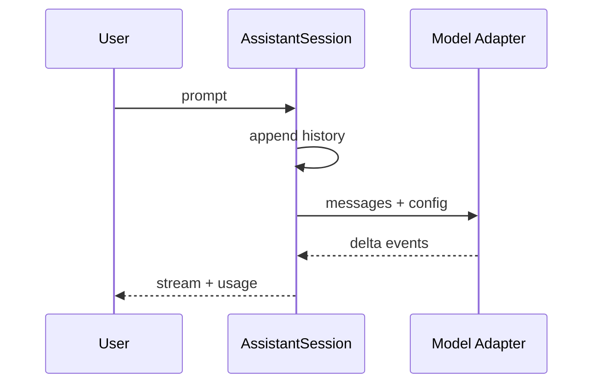
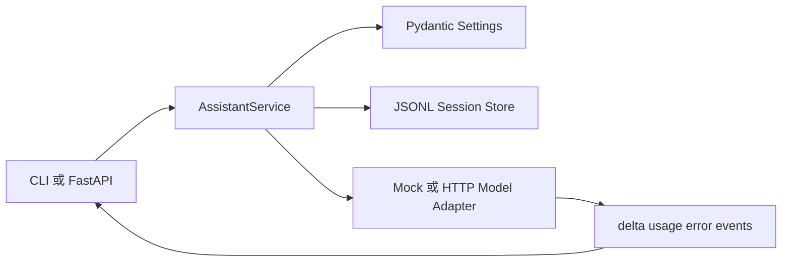
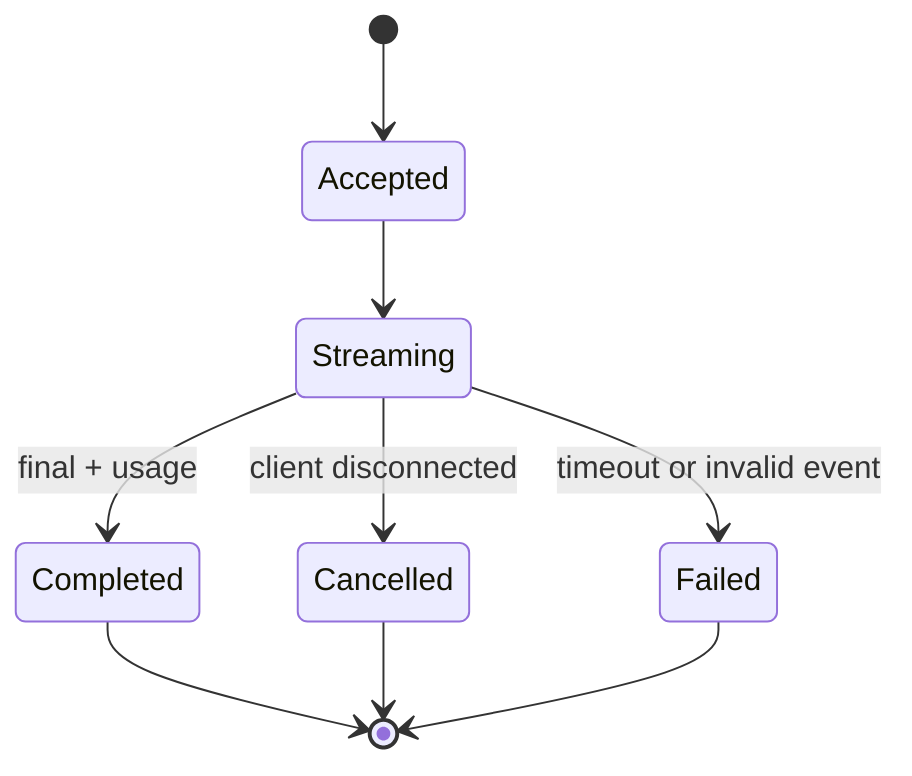

# 项目1：最小 AI Assistant

## 需求、架构与数据流
技术选型：Python 3.12、Pydantic 2、FastAPI、pytest 与 Docker；在线供应商通过适配器接入。

项目从一条完整请求链开始：会话服务拥有历史和事件协议，模型适配器只负责生成，客户端通过统一流接收正文、用量与错误。



实现对话历史、流式完成事件、Token 估算、配置和错误边界。 离线模式使用确定性 Mock，使无 API Key 也能运行和测试；在线服务通过适配器替换，领域结果保持稳定 Schema。



领域服务只依赖模型适配器协议，离线与在线实现返回相同事件 Schema；历史写入和 Usage 统计不由供应商对象直接控制。



每条流都以明确终止事件结束；在线供应商缺少 Usage 时标记未知，不用本地估算伪装为账单值。

`输入 → 配置加载 → JSONL 历史 → Mock/兼容 HTTP 模型 → SSE delta → Usage → 持久化`。独立实现位于 `src/ai_agent_book/apps/minimal_assistant.py`，直接测试位于 `tests/test_minimal_assistant_app.py`。

## 运行、测试与部署
```bash
PYTHONPATH=src .venv/bin/python projects/01-minimal-assistant/main.py
PYTHONPATH=src .venv/bin/python -m pytest tests/test_minimal_assistant_app.py -q
docker build -f projects/01-minimal-assistant/Dockerfile -t ai-agent-book/project-1 .
docker run --rm ai-agent-book/project-1
```

配置只从环境读取，默认 `APP_MODE=offline`。常见问题：离线 Token 只是估算，在线模式应读取供应商 Usage。扩展方向：接入真实流事件、持久会话和成本表。

## 实现说明与验收

`AssistantService` 将用户和助手消息保存为类型化 JSONL 历史，并把增量文本、Usage 和错误分成不同事件。`OpenAICompatibleChatModel` 实际发起 `/chat/completions` 请求并解析 SSE，测试使用 `httpx.MockTransport` 验证授权头、增量与 Usage，不需要真实密钥。API Key 只从环境变量读取。预期输出是若干 `delta` 事件和一个 `usage` 事件。

## 目录、配置与扩展

```text
01-minimal-assistant/  README.md  main.py  .env.example  Dockerfile  tests/
src/ai_agent_book/apps/minimal_assistant.py  # 完整实现
```

默认离线运行；在线模式填写 `MODEL_BASE_URL`、`MODEL_API_KEY` 与 `MODEL_NAME`。常见问题是在线服务未返回 Usage，此时应把计数标为未知而非伪造精确值。扩展方向包括 PostgreSQL 会话、SSE API、取消传播和模型路由。
