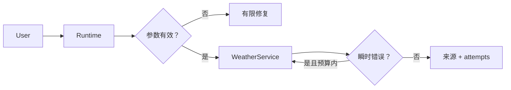
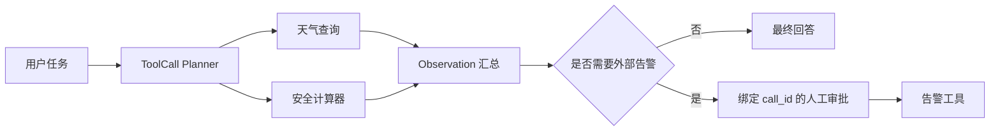
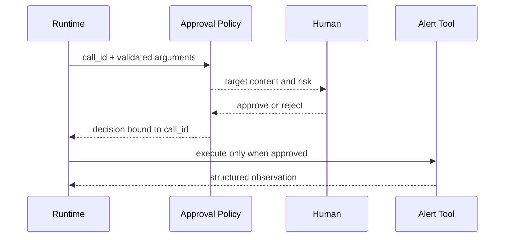

# 项目2：天气与工具调用 Agent


*图 P2-A　天气 Tool Agent 的模型提议与运行时门禁。*

图中模型没有执行权。所有工具调用先经过确定性校验和授权，高风险操作绑定人工确认；并行只用于相互独立的调用，重试则必须共享总预算并配合幂等策略。

## 需求、架构与数据流
技术选型：Python 3.12、Pydantic 2、FastAPI、pytest 与 Docker；在线供应商通过适配器接入。

项目把 Tool Calling 拆为提议、参数校验、策略、执行与观察五个阶段，确保模型选择工具不会自动获得执行权限。



实现多工具选择、参数校验、Tool Loop、有限重试和写操作审批。 离线模式使用确定性 Mock，使无 API Key 也能运行和测试；在线服务通过适配器替换，领域结果保持稳定 Schema。



并行只用于独立只读工具，告警属于外部副作用，必须在参数确定后使用与 `call_id` 绑定的批准决定。



参数错误和权限拒绝不重试；只有标记为暂时故障且仍在预算内的只读请求进入有限重试。

`输入 → Planner → ToolCall 列表 → Pydantic 校验 → 审批策略 → 并行工具 → Observation`。独立实现位于 `src/ai_agent_book/apps/weather_agent.py`，测试位于 `tests/test_weather_agent_app.py`。

## 运行、测试与部署
CLI 用于观察领域事件；`api.py` 提供持久 Run、幂等、租户隔离、取消、SSE 回放、Trace 与指标：
```bash
PYTHONPATH=src .venv/bin/python projects/02-weather-tool-agent/main.py
PYTHONPATH=src DATABASE_PATH=.data/project-2.db .venv/bin/uvicorn --app-dir projects/02-weather-tool-agent api:app --port 8102
PYTHONPATH=src .venv/bin/python -m pytest tests/test_weather_agent_app.py -q
docker build -f projects/02-weather-tool-agent/Dockerfile -t ai-agent-book/project-2 .
docker run --rm ai-agent-book/project-2
```

配置只从环境读取，默认 `APP_MODE=offline`。常见问题：Mock 天气是教学数据，不可用于业务告警。扩展方向：接入天气供应商、幂等审批和并行只读工具。

## 实现说明与验收

`ToolAgent` 接收可替换 Planner 的多个 ToolCall，只读工具可并行执行；天气工具在三次预算内重试瞬时错误，计算器只允许 AST 白名单运算，外部告警必须匹配 `call_id` 的批准决定。测试覆盖多工具、参数错误和审批前后行为。在线模型只需实现同一 Planner 协议。

## 目录、配置与扩展

```text
02-weather-tool-agent/  README.md  main.py  .env.example  Dockerfile  tests/
src/ai_agent_book/apps/weather_agent.py  # Tool Loop 与三个工具
```

天气密钥为空时使用 Fixture。常见问题是把所有错误都重试；本项目只重试瞬时故障，参数错误直接回传 Observation。扩展方向包括真实天气 Provider、并行调用 Trace、审批存储和幂等告警投递。
