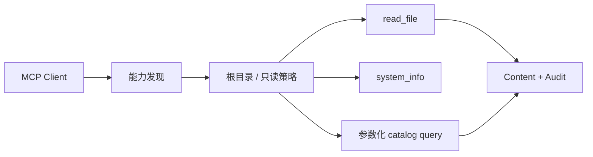

# 项目3：MCP 本地工具 Agent

## 需求、架构与数据流
技术选型：Python 3.12、Pydantic 2、FastAPI、pytest 与 Docker；在线供应商通过适配器接入。



实现 MCP Server/Client 边界、只读文件、系统信息和预定义数据库查询。 离线模式使用确定性 Mock，使无 API Key 也能运行和测试；在线服务通过适配器替换，领域结果保持稳定 Schema。

`initialize → 能力发现 → tools/call 或 resources/read → 文件/系统/SQLite → JSON-RPC 响应`。协议实现位于 `src/ai_agent_book/apps/mcp_local.py`，直接测试位于 `tests/test_mcp_local_app.py`。

## 运行、测试与部署
```bash
PYTHONPATH=src .venv/bin/python projects/03-mcp-local-agent/main.py
PYTHONPATH=src .venv/bin/python -m pytest tests/test_mcp_local_app.py -q
docker build -f projects/03-mcp-local-agent/Dockerfile -t ai-agent-book/project-3 .
docker run --rm ai-agent-book/project-3
```

配置只从环境读取，默认 `APP_MODE=offline`。常见问题：stdio 日志不得写协议 stdout，路径必须限制根目录。扩展方向：按当前 MCP SDK 实现协议层并部署远程认证。

## 实现说明与验收

`MCPLocalServer` 实现 JSON-RPC 2.0、2025-11-25 初始化、`tools/list`、`tools/call`、`resources/list` 和 `resources/read`；`--server` 启动逐行 stdio 循环。文件工具使用 `Path.resolve()` 阻止目录穿越，SQLite 查询参数化，错误响应不泄漏物理路径。远程 HTTP Transport 仍需额外实现 Origin、认证和会话治理。

## 目录、配置与扩展

```text
03-mcp-local-agent/  README.md  main.py  .env.example  Dockerfile  tests/
src/ai_agent_book/apps/mcp_local.py  # Server、Client、Transport
```

`MCP_ALLOWED_ROOT` 决定唯一文件根目录。常见问题是把日志写入协议 stdout；服务日志必须使用 stderr。扩展方向是 Streamable HTTP、OAuth 受保护资源元数据、分页、取消与官方 SDK 互操作测试。
