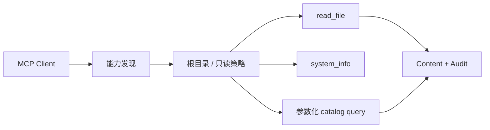
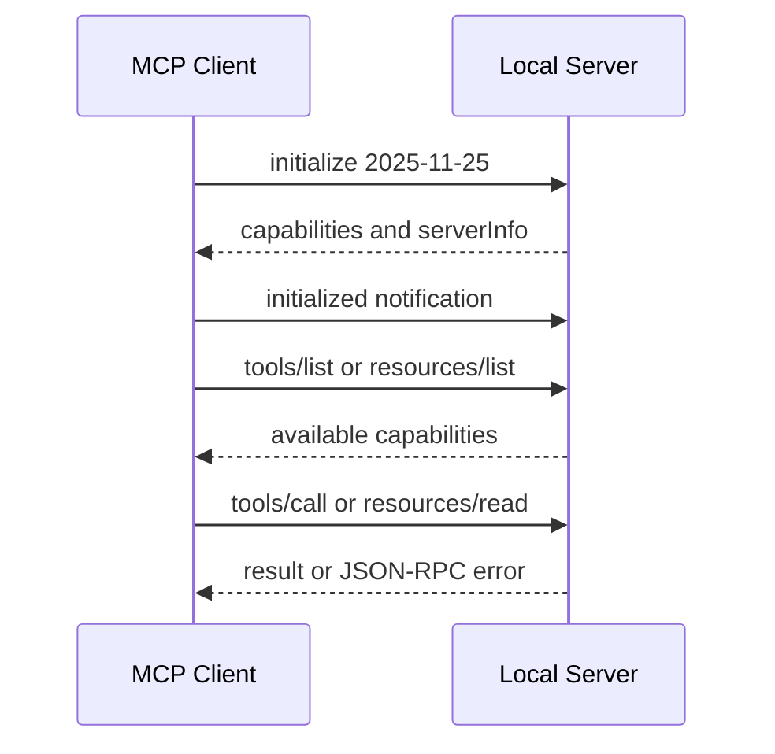
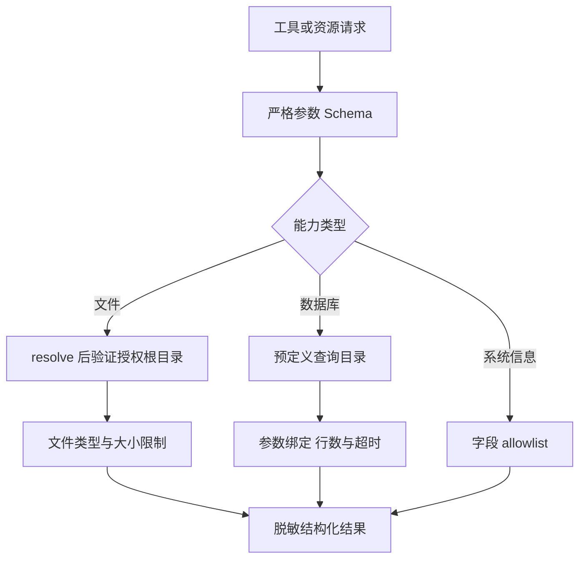

# 项目3：MCP 本地工具 Agent

## 需求、架构与数据流
技术选型：Python 3.12、Pydantic 2、FastAPI、pytest 与 Docker；在线供应商通过适配器接入。

项目以真实 JSON-RPC stdio 边界连接 Client 与 Server，并把文件、系统和数据库能力限制在可审计的只读策略内。



实现 MCP Server/Client 边界、只读文件、系统信息和预定义数据库查询。 离线模式使用确定性 Mock，使无 API Key 也能运行和测试；在线服务通过适配器替换，领域结果保持稳定 Schema。



stdout 只承载协议消息，日志写 stderr。初始化协商能力，但每次文件或数据库访问仍执行独立策略校验。



Server 不接受任意路径、任意 SQL 或任意系统命令。错误响应也不能泄露真实物理路径和内部异常栈。

`initialize → 能力发现 → tools/call 或 resources/read → 文件/系统/SQLite → JSON-RPC 响应`。协议实现位于 `src/ai_agent_book/apps/mcp_local.py`，直接测试位于 `tests/test_mcp_local_app.py`。

## 运行、测试与部署
```bash
PYTHONPATH=src .venv/bin/python projects/03-mcp-local-agent/main.py
PYTHONPATH=src .venv/bin/python -m pytest tests/test_mcp_local_app.py -q
docker build -f projects/03-mcp-local-agent/Dockerfile -t ai-agent-book/project-3 .
docker run --rm ai-agent-book/project-3
```

配置只从环境读取，默认 `APP_MODE=offline`。常见问题：stdio 日志不得写协议 stdout，路径必须限制根目录。当前官方 SDK 的隔离实现位于 [`official_sdk/`](https://github.com/wujinjun/ai-agent-book/tree/main/projects/03-mcp-local-agent/official_sdk)，固定 `mcp==2.0.0` 并直接测试 stdio 与无状态 Streamable HTTP。

## 实现说明与验收

`MCPLocalServer` 实现 JSON-RPC 2.0、2025-11-25 初始化、`tools/list`、`tools/call`、`resources/list` 和 `resources/read`；`--server` 启动逐行 stdio 循环。文件工具使用 `Path.resolve()` 阻止目录穿越，SQLite 查询参数化，错误响应不泄漏物理路径。`official_sdk/` 使用 2026-07-28 协议稳定线验证 Tool、Resource、Prompt、stdio 子进程和无状态 Streamable HTTP；远程生产部署仍需补齐 Origin、OAuth、对象授权、限流和审计。

## 目录、配置与扩展

```text
03-mcp-local-agent/  README.md  main.py  .env.example  Dockerfile  tests/
src/ai_agent_book/apps/mcp_local.py  # Server、Client、Transport
```

`MCP_ALLOWED_ROOT` 决定唯一文件根目录。常见问题是把日志写入协议 stdout；服务日志必须使用 stderr。扩展方向是 OAuth 受保护资源元数据、分页、取消、超时和授权回归测试。
