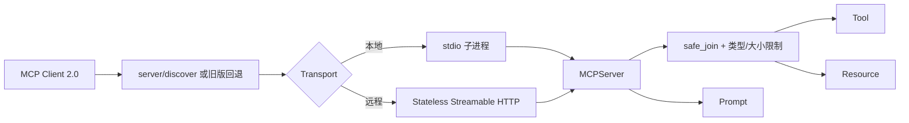

# 官方 MCP Python SDK 2.0.0 实测切片

本子工程是项目 3 的当前协议实现，固定 `mcp==2.0.0`，核对日期为 2026-08-07。它与上级目录中的 2025-11-25 手写 JSON-RPC 教学子集并存，用于说明从有状态初始化模型迁移到 2026-07-28 无状态请求模型时，哪些业务权限校验仍然不能省略。



图中的无状态只表示 HTTP 请求不依赖粘性会话，不表示服务无须身份、对象授权、速率限制或审计。`read_file` 每次调用都重新执行根目录、扩展名、存在性、大小和 UTF-8 校验；错误内容不返回物理路径。

## 安装与验证

```bash
cd projects/03-mcp-local-agent/official_sdk
python3.12 -m venv .venv
.venv/bin/python -m pip install -e '.[test]'
.venv/bin/pytest
.venv/bin/ruff check .
.venv/bin/mypy
```

默认 stdio 服务只在 stdout 写协议消息：

```bash
MCP_ALLOWED_ROOT=. .venv/bin/mcp-local-official --transport stdio
```

远程开发模式使用无状态 Streamable HTTP：

```bash
MCP_ALLOWED_ROOT=. MCP_HOST=127.0.0.1 MCP_PORT=8000 \
  .venv/bin/mcp-local-official --transport streamable-http
```

示例只绑定 loopback。生产部署必须在反向代理或资源服务器层补充 HTTPS、Origin 校验、OAuth 受保护资源元数据、受众与 Scope 校验、限流和审计；不能把 `0.0.0.0` 暴露当作部署完成。

对应章节：[`docs/part-03-rag-and-memory/ch11-mcp.md`](../../../docs/part-03-rag-and-memory/ch11-mcp.md)、[`docs/part-03-rag-and-memory/ch12-mcp-server.md`](../../../docs/part-03-rag-and-memory/ch12-mcp-server.md)。
