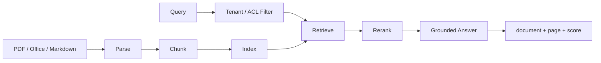
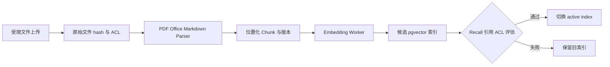
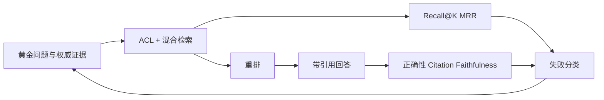

# 项目4：企业知识库 Agent

## 需求、架构与数据流
技术选型：Python 3.12、Pydantic 2、FastAPI、pytest 与 Docker；在线供应商通过适配器接入。

项目同时覆盖离线摄取和在线查询，权限在检索前过滤，最终回答保留文档、页码、Chunk 与分数等可验证引用。



实现文档导入、切分、Embedding 接口、检索、重排、引用和评估。 离线模式使用确定性 Mock，使无 API Key 也能运行和测试；在线服务通过适配器替换，领域结果保持稳定 Schema。



解析器、切分器、Embedding 与权限快照共同定义索引版本；本地哈希向量只用于离线测试，不代表生产语义质量。



检索与回答指标分开报告，才能判断问题来自文档、召回、重排还是生成。跨租户和注入文档属于发布必测项。

`输入 → PDF/DOCX/PPTX/Markdown 解析 → 重叠切分 → 哈希向量 → 租户过滤 → 混合检索/重排 → 页码引用 → 评估`。独立实现位于 `src/ai_agent_book/apps/knowledge_agent.py`，pgvector 表与 HNSW 索引位于 `schema.sql`，直接测试位于 `tests/test_knowledge_agent_app.py`。

## 运行、测试与部署
```bash
PYTHONPATH=src .venv/bin/python projects/04-knowledge-agent/main.py
PYTHONPATH=src .venv/bin/python -m pytest tests/test_knowledge_agent_app.py -q
docker build -f projects/04-knowledge-agent/Dockerfile -t ai-agent-book/project-4 .
docker run --rm ai-agent-book/project-4
```

配置只从环境读取，默认 `APP_MODE=offline`。常见问题：离线向量是测试替身，不能宣称真实语义效果。扩展方向：接入 PDF/Office 解析、pgvector 与黄金评估集。

## 实现说明与验收

`DocumentParser` 无需安装 Office 即可读取 DOCX/PPTX 的 XML，并限制解压后大小；PDF 使用 pypdf。`KnowledgeBase` 实现重叠切分、确定性本地 Embedding、稠密与词项混合评分、租户预过滤、重排和来源/页码/Chunk 引用。评估函数计算 Recall@K 与 MRR。离线向量用于教学和测试，生产部署用 `schema.sql` 的 pgvector 表替换存储层并接入正式 Embedding/Reranker。

`PgVectorKnowledgeRepository` 使用 Psycopg 实际创建 vector 扩展、写入 128 维教学向量、建立 HNSW 索引并执行带租户条件的余弦查询。根级 Compose 使用 `pgvector/pgvector:pg17`，数据库端口只绑定宿主 loopback；`scripts/verify_pgvector.py` 提供可重复的真实摄取与检索验收。

## 目录、配置与扩展

```text
04-knowledge-agent/  README.md  main.py  schema.sql  .env.example  Dockerfile  tests/
src/ai_agent_book/apps/knowledge_agent.py  # 解析、索引、检索、评估
```

导入文件在不可信解析边界中处理，生产环境应限制文件大小、页数和解压资源。常见问题是把本地哈希向量当成真实语义效果；它只用于离线教学。扩展方向包括 OCR、正式 Embedding、Cross-Encoder Reranker、pgvector Repository 和黄金集流水线。
