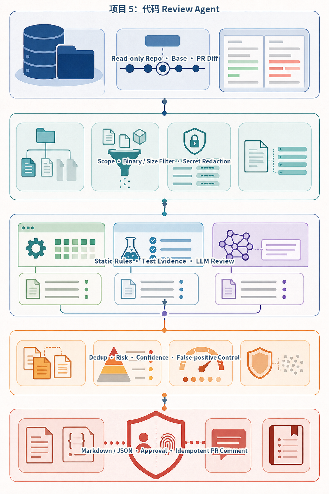
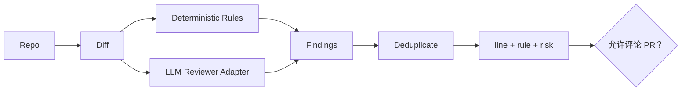
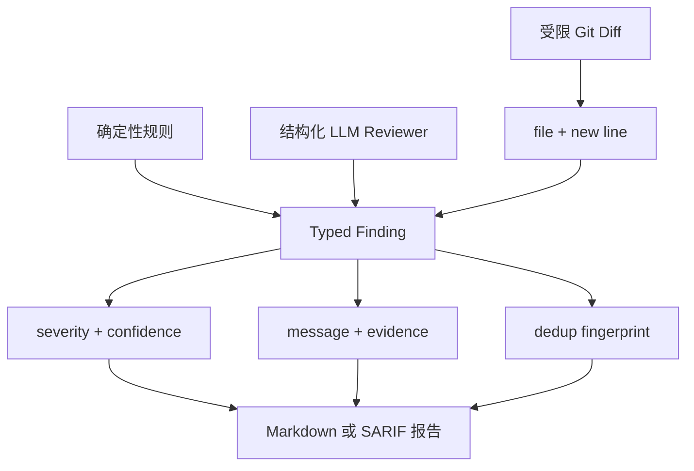
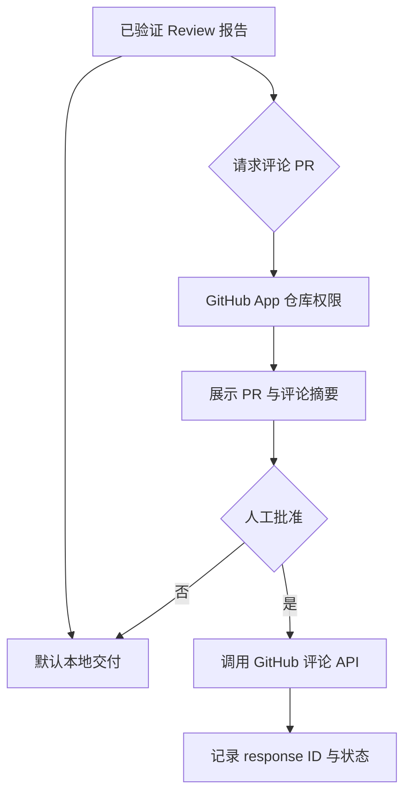

# 项目5：代码 Review Agent



*图 P5-A　Code Review Agent 的证据合并与外部发布门。*

默认产物是本地 Markdown/JSON 报告，不是 GitHub 副作用。每条发现必须指向 Diff 范围和可检查证据；可选 PR 评论需要单独授权、人工确认与稳定幂等键。

## 需求、架构与数据流
技术选型：Python 3.12、Pydantic 2、FastAPI、pytest 与 Docker；在线供应商通过适配器接入。

项目以 Git Diff 为唯一审查范围，确定性规则和模型 Reviewer 分别产出证据，外部 PR 评论保持默认关闭。



实现 Diff 解析、静态规则、LLM Review 接口、风险分类和报告。 离线模式使用确定性 Mock，使无 API Key 也能运行和测试；在线服务通过适配器替换，领域结果保持稳定 Schema。



静态规则证据与模型建议分别保留，不能把概率性发现伪装成编译器结论；报告始终可回到具体 Diff 行。



默认不产生外部写入。批准绑定仓库、PR、提交 SHA 与评论内容，Diff 变化后必须重新审查。

`Git 仓库 → Diff 新增行 → 静态规则 + 语义 Reviewer → 去重/风险排序 → Markdown 报告 → 审批后可选 PR 评论`。独立实现位于 `src/ai_agent_book/apps/code_review.py`，直接测试位于 `tests/test_code_review_app.py`。

## 运行、测试与部署
CLI 用于观察领域事件；`api.py` 提供持久 Run、幂等、租户隔离、取消、SSE 回放、Trace 与指标：
```bash
PYTHONPATH=src .venv/bin/python projects/05-code-review-agent/main.py
PYTHONPATH=src DATABASE_PATH=.data/project-5.db .venv/bin/uvicorn --app-dir projects/05-code-review-agent api:app --port 8105
PYTHONPATH=src .venv/bin/python -m pytest tests/test_code_review_app.py -q
docker build -f projects/05-code-review-agent/Dockerfile -t ai-agent-book/project-5 .
docker run --rm ai-agent-book/project-5
```

配置只从环境读取，默认 `APP_MODE=offline`。常见问题：默认只生成报告，不自动评论 PR 或修改代码。扩展方向：接入 GitHub App、SARIF 与需审批的 PR 评论。

## 实现说明与验收

`GitRepository` 使用无 Shell 的参数列表和 Ref 白名单读取真实仓库 Diff；解析器保存新文件行号。静态规则覆盖凭证、可变默认参数、宽泛异常与动态执行，`SemanticReviewer` 是可替换的结构化 LLM 边界。报告按风险排序并生成 Markdown。`GitHubCommentClient` 使用官方 REST 端点，但 `approved=False` 时绝不发出请求；测试用临时 Git 仓库和 `httpx.MockTransport` 验证完整链路。

生产参考边界还包括三个模型外控制点：

- `DiffPolicy` 对字节数、变更文件数和新增行数设置硬预算，在进入静态规则或 LLM Reviewer 前拒绝超大审查范围，避免成本失控和拒绝服务。
- `WebhookDeliveryStore` 使用 GitHub Webhook HMAC-SHA256 签名验证请求，并把 delivery ID、载荷哈希和处理状态持久化；同一 delivery 重放不会重复触发 Review，若相同 ID 携带不同载荷则直接拒绝。
- `ApprovalAuthority` 把人工批准绑定到仓库、PR、提交 SHA、Review 报告 SHA-256 和过期时间。Diff 或报告内容变化后，旧令牌不能用于发布；实际评论带稳定报告标记，便于后续查询与去重。

这些机制解决“同一个 Webhook 被多次投递”“审批后提交已经变化”“巨型 Diff 耗尽模型预算”等故障，但没有宣称实现完整 GitHub App。生产接入仍需安装级 Token、仓库 allowlist、权限最小化、Webhook IP/时间策略和评论查询接口；这些属于真实 GitHub 环境联调边界。

专项测试命令如下：

```bash
PYTHONPATH=src .venv/bin/python -m pytest tests/test_code_review_app.py -q
```

测试覆盖临时仓库 Diff、规则与报告、未审批零网络调用、审批绑定、Webhook 伪造签名、重复 delivery、冲突载荷和超预算 Diff。预期为 `5 passed`。

## 目录、配置与扩展

```text
05-code-review-agent/  README.md  main.py  .env.example  Dockerfile  tests/
src/ai_agent_book/apps/code_review.py  # Git、规则、报告、GitHub 边界
```

默认只输出报告，不发送 PR 评论。常见问题是把模型建议当成编译器结论；确定性规则、构建和测试证据必须独立保留。扩展方向包括安装级 GitHub App 鉴权、SARIF、增量 Repo Map、容器化多语言静态分析、按提交 SHA 查询既有评论，以及带审批的行级评论。
