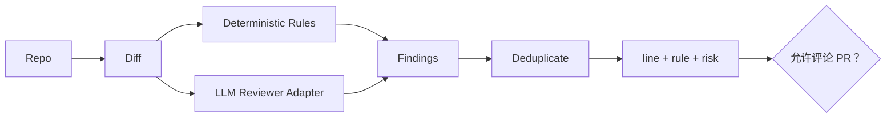

# 项目5：代码 Review Agent

## 需求、架构与数据流
技术选型：Python 3.12、Pydantic 2、FastAPI、pytest 与 Docker；在线供应商通过适配器接入。



实现 Diff 解析、静态规则、LLM Review 接口、风险分类和报告。 离线模式使用确定性 Mock，使无 API Key 也能运行和测试；在线服务通过适配器替换，领域结果保持稳定 Schema。

`Git 仓库 → Diff 新增行 → 静态规则 + 语义 Reviewer → 去重/风险排序 → Markdown 报告 → 审批后可选 PR 评论`。独立实现位于 `src/ai_agent_book/apps/code_review.py`，直接测试位于 `tests/test_code_review_app.py`。

## 运行、测试与部署
```bash
PYTHONPATH=src .venv/bin/python projects/05-code-review-agent/main.py
PYTHONPATH=src .venv/bin/python -m pytest tests/test_code_review_app.py -q
docker build -f projects/05-code-review-agent/Dockerfile -t ai-agent-book/project-5 .
docker run --rm ai-agent-book/project-5
```

配置只从环境读取，默认 `APP_MODE=offline`。常见问题：默认只生成报告，不自动评论 PR 或修改代码。扩展方向：接入 GitHub App、SARIF 与需审批的 PR 评论。

## 实现说明与验收

`GitRepository` 使用无 Shell 的参数列表和 Ref 白名单读取真实仓库 Diff；解析器保存新文件行号。静态规则覆盖凭证、可变默认参数、宽泛异常与动态执行，`SemanticReviewer` 是可替换的结构化 LLM 边界。报告按风险排序并生成 Markdown。`GitHubCommentClient` 使用官方 REST 端点，但 `approved=False` 时绝不发出请求；测试用临时 Git 仓库和 `httpx.MockTransport` 验证完整链路。

## 目录、配置与扩展

```text
05-code-review-agent/  README.md  main.py  .env.example  Dockerfile  tests/
src/ai_agent_book/apps/code_review.py  # Git、规则、报告、GitHub 边界
```

默认只输出报告，不发送 PR 评论。常见问题是把模型建议当成编译器结论；确定性规则、构建和测试证据必须独立保留。扩展方向包括 GitHub App 鉴权、SARIF、增量 Repo Map、语言专用静态分析和带审批的行级评论。
