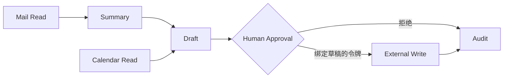
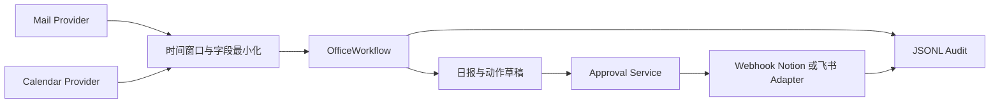
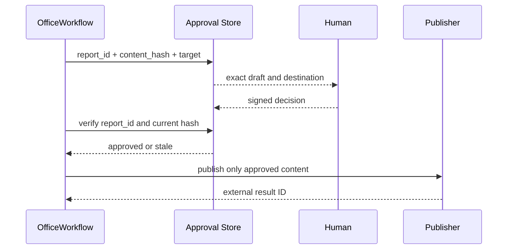

# 项目6：自动办公 Agent

## 需求、架构与数据流
技术选型：Python 3.12、Pydantic 2、FastAPI、pytest 与 Docker；在线供应商通过适配器接入。

项目将邮件与日历读取视为只读输入，将发布日报等外部写入置于内容绑定的审批门禁之后，并记录完整审计事件。



实现邮件读取接口、摘要、日报、日历查询、外部系统适配、审批和审计。 离线模式使用确定性 Mock，使无 API Key 也能运行和测试；在线服务通过适配器替换，领域结果保持稳定 Schema。



Provider 凭证只存在适配器，模型仅获得任务所需字段。Fixture 与真实 Provider 实现相同协议，离线测试覆盖完整控制流。



审批后任何正文或目标修改都会改变摘要并使令牌失效。准备、阻止、批准和发布均进入不可混淆的审计事件。

`邮件与日历 Provider → 时间窗口过滤 → 摘要/日报 → 内容摘要绑定审批 → Mock/Webhook 发布 → JSONL 审计`。独立实现位于 `src/ai_agent_book/apps/office_agent.py`，直接测试位于 `tests/test_office_agent_app.py`。

## 运行、测试与部署
```bash
PYTHONPATH=src .venv/bin/python projects/06-office-agent/main.py
PYTHONPATH=src .venv/bin/python -m pytest tests/test_office_agent_app.py -q
docker build -f projects/06-office-agent/Dockerfile -t ai-agent-book/project-6 .
docker run --rm ai-agent-book/project-6
```

配置只从环境读取，默认 `APP_MODE=offline`。常见问题：发送、创建日历和写 Notion 前必须审批。扩展方向：接入 Gmail/Calendar/Notion 或飞书并实施最小 OAuth scope。

## 实现说明与验收

`OfficeWorkflow` 通过 Mail/Calendar Protocol 接入数据，Fixture 让无账号环境完整运行；日报包含邮件摘要与日程。批准令牌绑定报告 ID、内容摘要和审批者，未批准绝不会发出 HTTP 请求。`WebhookPublisher` 可连接飞书自定义机器人或内部办公 Webhook，测试以 MockTransport 验证真实 HTTP 边界。所有准备、阻止、批准和发布动作写入 JSONL 审计。

## 目录、配置与扩展

```text
06-office-agent/  README.md  main.py  .env.example  Dockerfile  tests/
src/ai_agent_book/apps/office_agent.py  # Provider、审批、发布、审计
```

Fixture 模式不需要邮箱账号；Webhook 只有在绑定内容的批准令牌存在时调用。常见问题是审批后继续修改正文，本项目用摘要使旧令牌失效。扩展方向包括 Gmail/Outlook OAuth 最小 Scope、日历冲突检测、Notion 页面适配器和审计归档。
