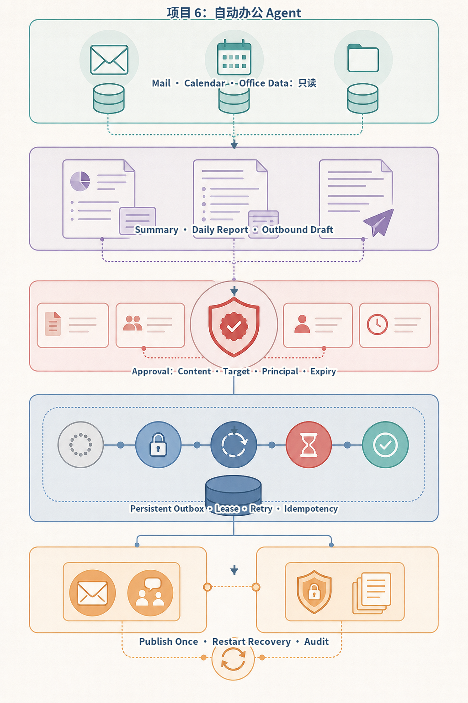
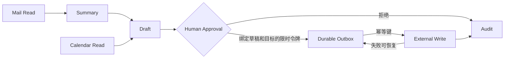
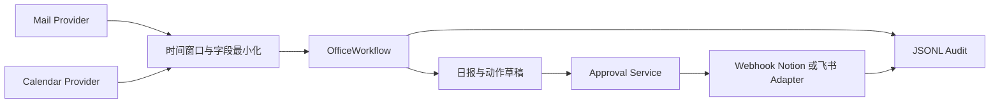
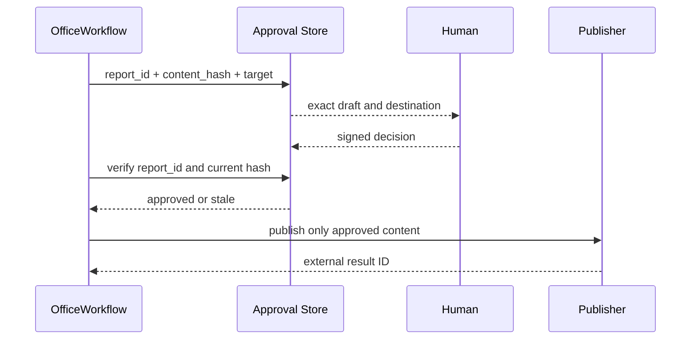
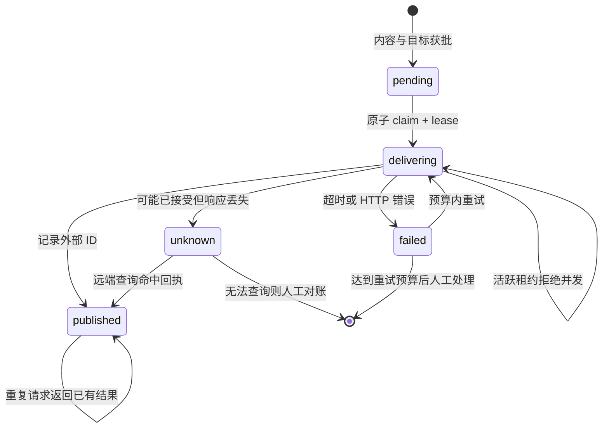

# 项目6：自动办公 Agent



*图 P6-A　自动办公 Agent 的审批与持久 Outbox。*

审批不能只绑定一句“允许发送”，而要绑定准确内容、目标、主体和时效。Outbox 负责跨进程恢复；下游幂等键与结果核对共同提供不重复发布的工程边界，而不是宣称网络世界存在无条件 exactly-once。

## 需求、架构与数据流
技术选型：Python 3.12、Pydantic 2、FastAPI、pytest 与 Docker；在线供应商通过适配器接入。

项目将邮件与日历读取视为只读输入，将发布日报等外部写入置于内容绑定的审批门禁之后，并记录完整审计事件。



实现邮件读取接口、摘要、日报、日历查询、外部系统适配、审批和审计。 离线模式使用确定性 Mock，使无 API Key 也能运行和测试；在线服务通过适配器替换，领域结果保持稳定 Schema。



Provider 凭证只存在适配器，模型仅获得任务所需字段。Fixture 与真实 Provider 实现相同协议，离线测试覆盖完整控制流。



审批后任何正文或目标修改都会使令牌失效。令牌只以 SHA-256 摘要落库，不保存明文；批准记录、目标、有效期和 Outbox 都持久化到 SQLite。准备、阻止、批准、失败和发布均进入不可混淆的审计事件。



Outbox 的主键由报告 ID、报告摘要和目标共同计算。工作进程崩溃后，租约到期即可重新声明；若远端支持 `Idempotency-Key`，未知结果重试也不会产生重复写入。实现进一步区分连接失败与歧义超时：前者通常意味着尚未送达，可进入有限重试；读取超时或部分写失败可能发生在远端已经接受之后，先通过 `ReceiptReconciler` 按幂等键查询回执。查询命中则直接记为 `published`；无法确认则记为 `unknown`，普通调用不会再次领取，必须人工对账。若目标服务既不支持幂等键也无法查询，不能声称 SQLite 单独提供 exactly-once。

`邮件与日历 Provider → 时间窗口过滤 → 摘要/日报 → 内容摘要绑定审批 → Mock/Webhook 发布 → JSONL 审计`。独立实现位于 `src/ai_agent_book/apps/office_agent.py`，直接测试位于 `tests/test_office_agent_app.py`。

## 运行、测试与部署
CLI 用于观察领域事件；`api.py` 提供持久 Run、幂等、租户隔离、取消、SSE 回放、Trace 与指标：
```bash
PYTHONPATH=src .venv/bin/python projects/06-office-agent/main.py
PYTHONPATH=src DATABASE_PATH=.data/project-6.db .venv/bin/uvicorn --app-dir projects/06-office-agent api:app --port 8106
PYTHONPATH=src .venv/bin/python -m pytest tests/test_office_agent_app.py -q
docker build -f projects/06-office-agent/Dockerfile -t ai-agent-book/project-6 .
docker run --rm ai-agent-book/project-6
```

配置只从环境读取，默认 `APP_MODE=offline`。常见问题：发送、创建日历和写 Notion 前必须审批。扩展方向：接入 Gmail/Calendar/Notion 或飞书并实施最小 OAuth scope。

## 实现说明与验收

`OfficeWorkflow` 通过 Mail/Calendar Protocol 接入数据，Fixture 让无账号环境完整运行；日报包含邮件摘要与日程。批准令牌绑定报告 ID、内容摘要、目标、审批者和有效期，未批准绝不会发出 HTTP 请求。`ApprovalOutboxStore` 提供跨进程恢复、租约、最多三次确定失败尝试、成功结果去重与未知状态冻结；`WebhookPublisher` 发送稳定 `Idempotency-Key`，可选 `ReceiptReconciler` 查询远端业务回执，测试以 MockTransport 验证真实 HTTP 边界。所有准备、阻止、批准、失败、未知、对账和发布动作写入 JSONL 审计，日志仅记录错误类型而不记录凭证或完整响应。

## 目录、配置与扩展

```text
06-office-agent/  README.md  main.py  .env.example  Dockerfile  tests/
src/ai_agent_book/apps/office_agent.py  # Provider、审批、发布、审计
```

Fixture 模式不需要邮箱账号；Webhook 只有在绑定内容与目标的有效批准令牌存在时调用。常见问题是审批后继续修改正文，本项目会重新计算摘要并拒绝旧令牌。当前真实边界是通用 Webhook，尚未假装实现 Gmail、Outlook、Notion 或飞书 OAuth：生产扩展需增加最小 Scope、令牌轮换、分页/增量同步、供应商限流、远端业务键查询、日历冲突检测与审计归档。
