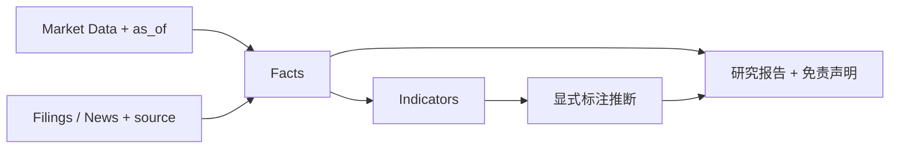

# 项目7：股票研究 Agent

## 需求、架构与数据流
技术选型：Python 3.12、Pydantic 2、FastAPI、pytest 与 Docker；在线供应商通过适配器接入。



实现行情、新闻、公告/财报接口、基础指标和结构化研究报告。 离线模式使用确定性 Mock，使无 API Key 也能运行和测试；在线服务通过适配器替换，领域结果保持稳定 Schema。

`行情/新闻/公告 Provider → 并发采集 → 数据时间与来源 → SMA/收益率/RSI → 事实与推断分栏 → 结构化报告`。独立实现位于 `src/ai_agent_book/apps/stock_research.py`，直接测试位于 `tests/test_stock_research_app.py`。

## 运行、测试与部署
```bash
PYTHONPATH=src .venv/bin/python projects/07-stock-research-agent/main.py
PYTHONPATH=src .venv/bin/python -m pytest tests/test_stock_research_app.py -q
docker build -f projects/07-stock-research-agent/Dockerfile -t ai-agent-book/project-7 .
docker run --rm ai-agent-book/project-7
```

配置只从环境读取，默认 `APP_MODE=offline`。常见问题：本项目不构成投资建议，不输出确定买卖指令。扩展方向：接入合规数据源、缓存、引用校验与回测隔离。

## 实现说明与验收

`StockResearchAgent` 并发调用行情、新闻和公告 Provider，校验 OHLC，计算 SMA5、五日收益率和 RSI14。每条事实带来源 URL 与观察时间，推断单独列出，报告固定包含“不构成投资建议”。`HttpMarketProvider` 实际实现超时 HTTP 数据边界并由 MockTransport 测试。生产接入还需按数据供应商契约处理交易所时区、复权和授权。

## 目录、配置与扩展

```text
07-stock-research-agent/  README.md  main.py  .env.example  Dockerfile  tests/
src/ai_agent_book/apps/stock_research.py  # Provider、指标与报告
```

默认行情、新闻和公告均为明确标记的 Fixture。常见问题是混淆发布日期、交易日和抓取时间，生产 Provider 必须分别保留。扩展方向包括正式公告源、行业分类、缓存、来源去重和研究质量评估；不扩展为自动交易或确定性买卖建议。
