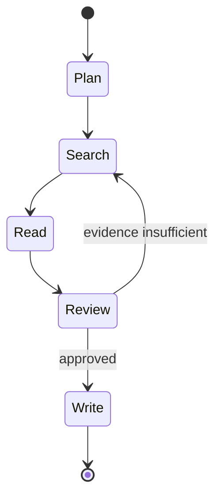

# 项目8：LangGraph 研究工作流 Agent

## 需求、架构与数据流
技术选型：Python 3.12、Pydantic 2、FastAPI、pytest 与 Docker；在线供应商通过适配器接入。



实现规划、搜索、读取、证据表、重试、Reviewer、Checkpoint 和人工中断。 离线模式使用确定性 Mock，使无 API Key 也能运行和测试；在线服务通过适配器替换，领域结果保持稳定 Schema。

`输入 → LangGraph Plan → 带 RetryPolicy 的 Search → Read → Reviewer 条件边 → interrupt → Command(resume) → Report`。独立实现位于 `src/ai_agent_book/apps/langgraph_research.py`，固定使用并实测 `langgraph==1.2.9`，直接测试位于 `tests/test_langgraph_research_app.py`。

## 运行、测试与部署
```bash
PYTHONPATH=src .venv/bin/python projects/08-research-workflow/main.py
PYTHONPATH=src .venv/bin/python -m pytest tests/test_langgraph_research_app.py -q
docker build -f projects/08-research-workflow/Dockerfile -t ai-agent-book/project-8 .
docker run --rm ai-agent-book/project-8
```

配置只从环境读取，默认 `APP_MODE=offline`。常见问题：外部搜索内容不可信，重规划不能改变系统目标。扩展方向：按当前 LangGraph 版本实现持久图和恢复。

## 实现说明与验收

`build_research_graph` 使用真实 `StateGraph`、`InMemorySaver`、`RetryPolicy`、条件边、`interrupt` 和 `Command(resume=...)`。搜索瞬时失败会按节点策略重试；Reviewer 要求至少两个独立来源，证据不足在轮次上限后失败；通过后暂停等待人工批准。测试检查实际 Checkpoint 快照、待恢复节点、重试次数与恢复报告。生产环境应把内存 Checkpointer 替换为数据库实现。

## 目录、配置与扩展

```text
08-research-workflow/  README.md  main.py  .env.example  Dockerfile  tests/
src/ai_agent_book/apps/langgraph_research.py  # LangGraph 1.2.9 图
```

依赖固定 `langgraph==1.2.9`。常见问题是恢复时更换 `thread_id`，这会创建新线程而非恢复旧状态。扩展方向包括数据库 Checkpointer、真实搜索/读取 Provider、引用校验、流式事件和 Checkpoint Schema 迁移测试。
