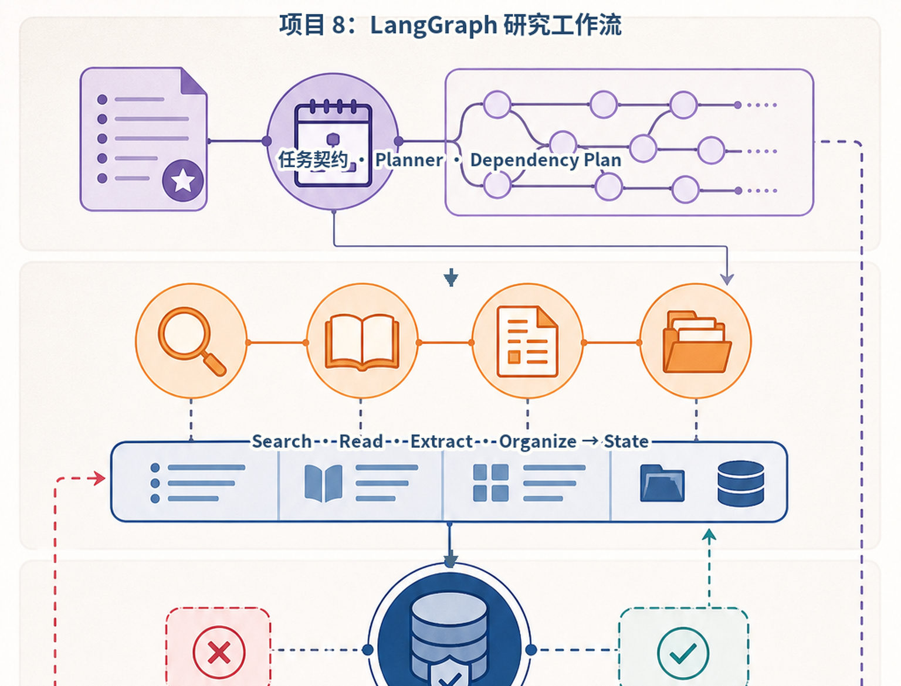
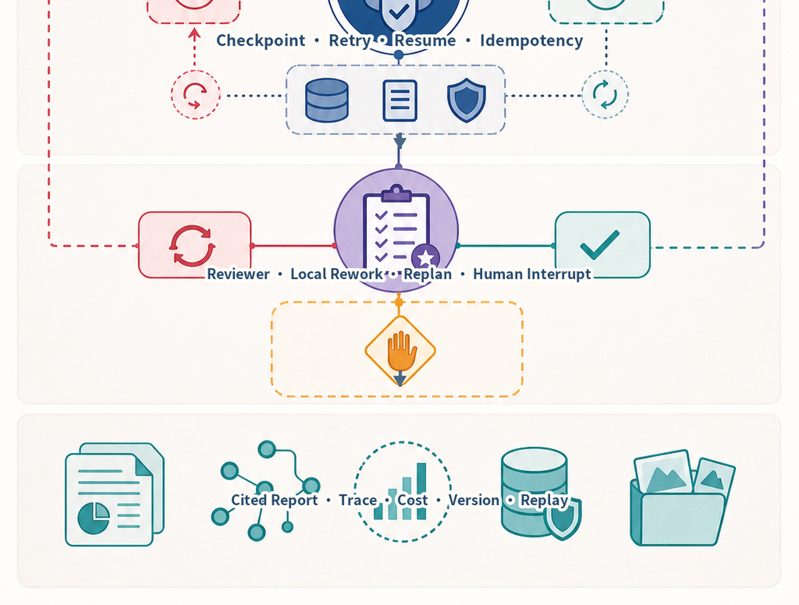
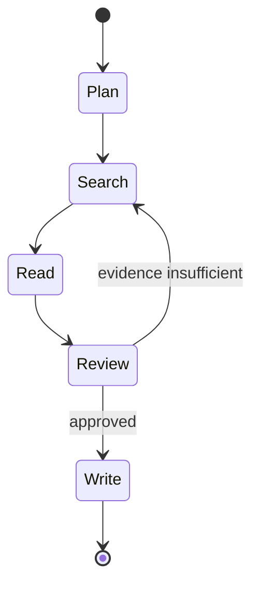
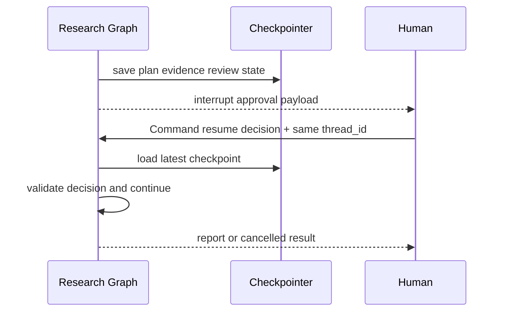
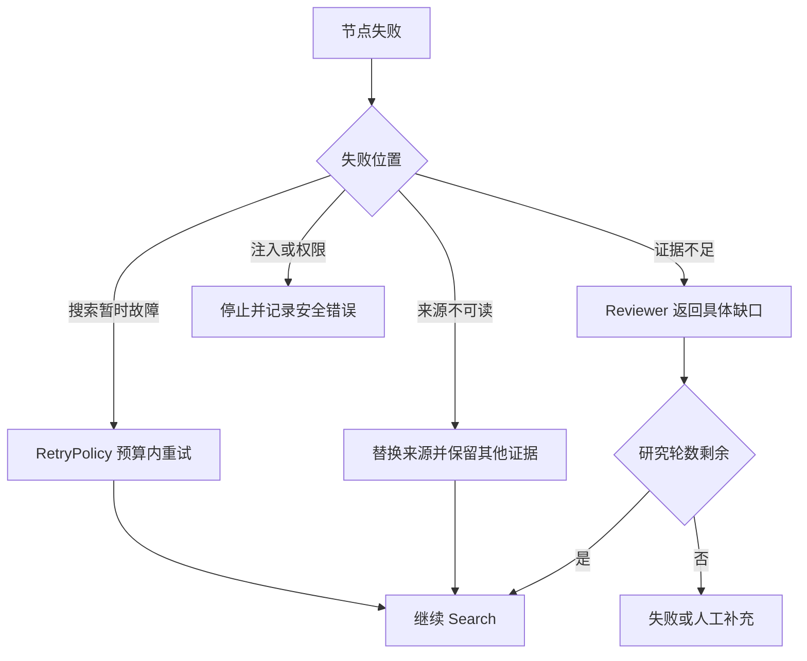
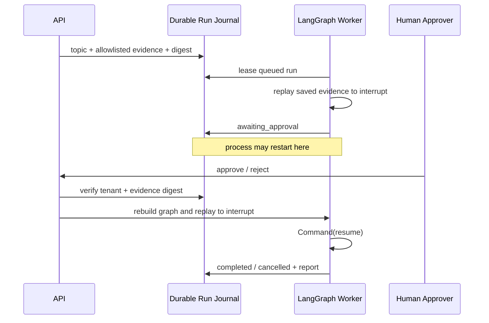
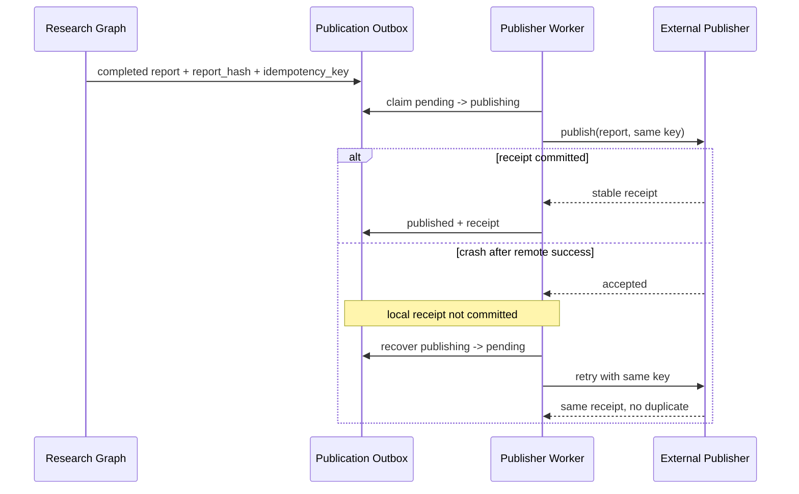

# 项目8：LangGraph 研究工作流 Agent





*图 P8-A　LangGraph 研究工作流的状态、恢复与人工中断。*

Checkpoint 保存的是可恢复状态，不会自动让外部副作用可重放；搜索写缓存、发布报告等动作仍需幂等键。项目中的报告发布因此使用独立持久 Outbox，而不是把“发布”直接塞进会被重放的图节点。Reviewer 只返工失败节点，避免每次校验失败都重跑整条链路。

## 需求、架构与数据流
技术选型：Python 3.12、Pydantic 2、FastAPI、pytest 与 Docker；在线供应商通过适配器接入。

项目用真实 LangGraph 状态图组织规划、搜索、读取、评审、Checkpoint 与人工中断，恢复依赖稳定线程标识和证据状态。



实现规划、搜索、读取、证据表、重试、Reviewer、Checkpoint 和人工中断。 离线模式使用确定性 Mock，使无 API Key 也能运行和测试；在线服务通过适配器替换，领域结果保持稳定 Schema。



恢复依赖稳定 `thread_id` 和可序列化 State。人工决定、证据版本和剩余预算都需在继续前重新校验。



重试和重规划不改变系统目标或来源 allowlist；已经验证的 Evidence 不因单个下游失败而全部丢弃。

`输入 → LangGraph Plan → 带 RetryPolicy 的 Search → Read → Reviewer 条件边 → interrupt → Command(resume) → Report`。独立实现位于 `src/ai_agent_book/apps/langgraph_research.py`，固定使用并实测 `langgraph==1.2.9`，直接测试位于 `tests/test_langgraph_research_app.py`。

## 运行、测试与部署
CLI 用于观察领域事件；`api.py` 提供持久 Run、幂等、租户隔离、取消、SSE 回放、Trace 与指标：
```bash
PYTHONPATH=src .venv/bin/python projects/08-research-workflow/main.py
PYTHONPATH=src DATABASE_PATH=.data/project-8.db .venv/bin/uvicorn --app-dir projects/08-research-workflow api:app --port 8108
PYTHONPATH=src .venv/bin/python -m pytest tests/test_langgraph_research_app.py -q
docker build -f projects/08-research-workflow/Dockerfile -t ai-agent-book/project-8 .
docker run --rm ai-agent-book/project-8
```

配置只从环境读取，默认 `APP_MODE=offline`。常见问题：外部搜索内容不可信，重规划不能改变系统目标。扩展方向：按当前 LangGraph 版本实现持久图和恢复。

## 实现说明与验收

`build_research_graph` 使用真实 `StateGraph`、`InMemorySaver`、`RetryPolicy`、条件边、`interrupt` 和 `Command(resume=...)`。搜索瞬时失败会按节点策略重试；Reviewer 要求至少两个独立来源，证据不足在轮次上限后失败；通过后暂停等待人工批准。测试检查实际 Checkpoint 快照、待恢复节点、重试次数与恢复报告。生产环境应把内存 Checkpointer 替换为数据库实现。

## 目录、配置与扩展

```text
08-research-workflow/  README.md  main.py  .env.example  Dockerfile  tests/
src/ai_agent_book/apps/langgraph_research.py  # LangGraph 1.2.9 图
```

依赖固定 `langgraph==1.2.9`。常见问题是恢复时更换 `thread_id`，这会创建新线程而非恢复旧状态。扩展方向包括数据库 Checkpointer、真实搜索/读取 Provider、引用校验、流式事件和 Checkpoint Schema 迁移测试。

## 跨进程恢复：持久输入与确定性重放

当前固定的 LangGraph 安装只包含 `InMemorySaver`，因此本项目不把内存快照描述成跨进程持久化。`DurableResearchService` 将已通过来源 Allowlist 的证据、主题、哈希、状态和事件写入 SQLite；服务重启后重建同版本图，使用已保存的只读证据重放到 `interrupt`，再应用人工审批 `Command`。这样不会重复联网搜索，也能检测持久证据被篡改。



这种方案适用于重放安全的只读步骤。若图包含不可重复的外部写操作，必须改用支持事务 Checkpoint 的持久 Saver，并为每个副作用保存幂等回执；不能依赖重放侥幸不重复执行。

## 外部副作用：报告发布 Outbox

`DurableResearchService.enqueue_publication()` 只接受已完成且报告非空的 Run。它把 `tenant_id + run_id + report_hash` 组成稳定幂等键，并在调用外部 Publisher 前持久化 `pending` 记录。Worker 原子领取后在数据库事务外发布，再保存远端回执。若远端已成功而进程尚未保存回执就崩溃，恢复程序把 `publishing` 改回 `pending`，并用同一幂等键重试。



这一保证依赖 Provider 对幂等键的真实支持。若 Provider 不支持幂等键或无法查询远端状态，崩溃窗口中的结果只能标记为 `unknown` 并转人工对账，不能通过数据库事务得到 exactly-once。测试还会在 Provider 调用前校验报告哈希，防止完成后的内容被篡改再发布。
