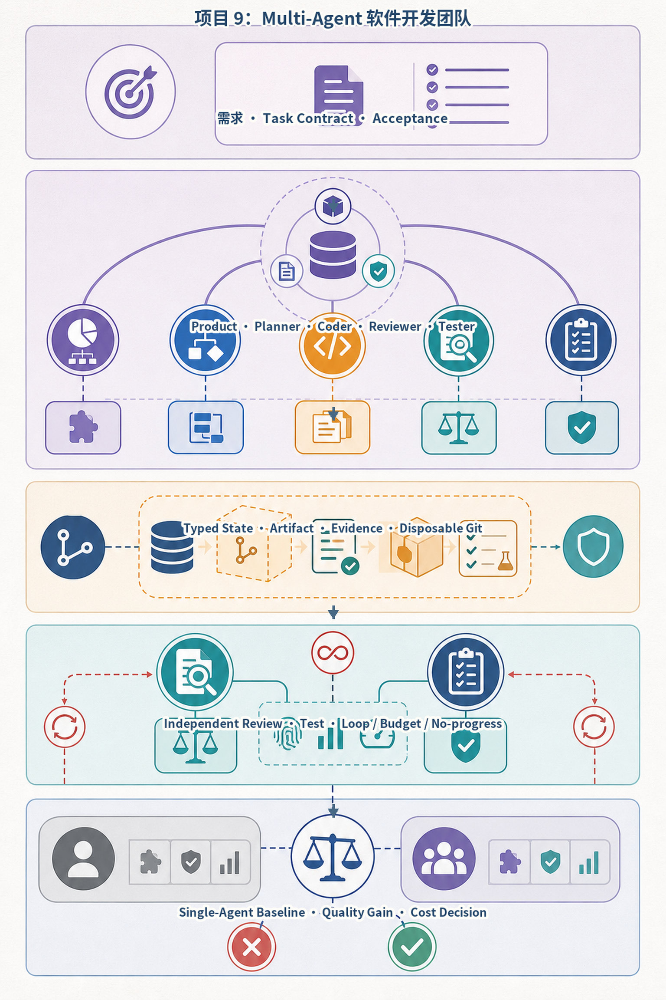
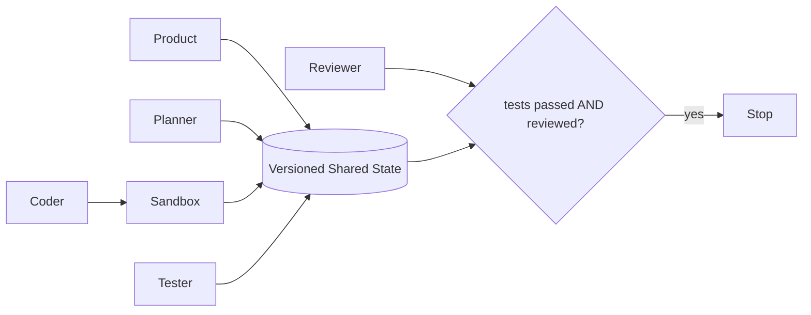
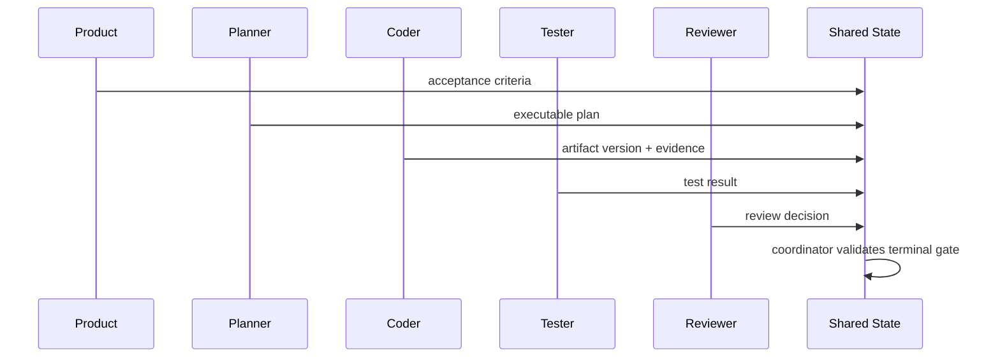
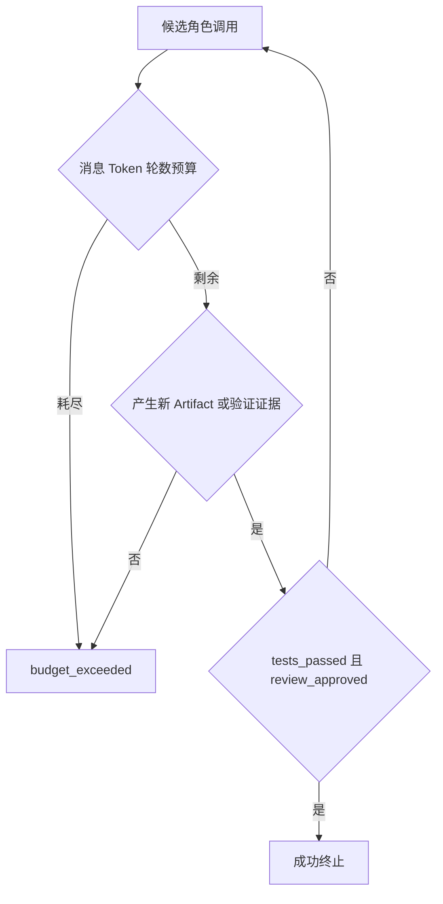
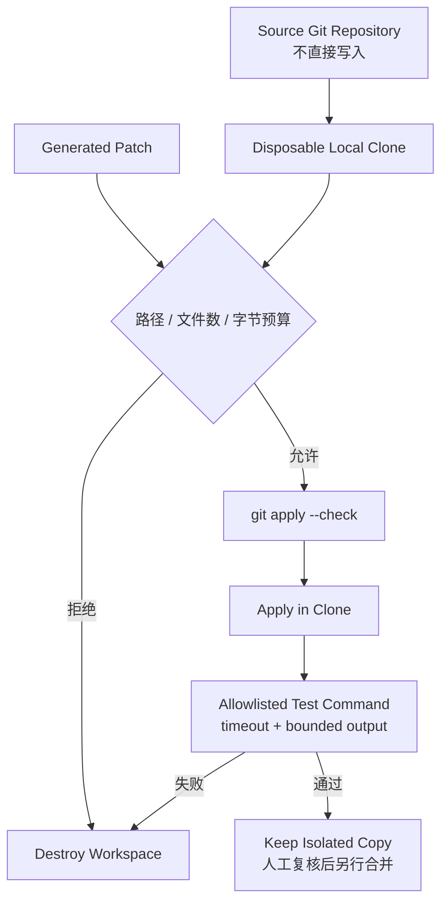

# 项目9：Multi-Agent 软件开发团队



*图 P9-A　多 Agent 开发团队的共享状态、隔离工作区与验收。*

角色不通过无界闲聊协作，而是读写带版本的 Artifact 与 Evidence。状态指纹重复、预算耗尽或连续无进展都会终止运行；只有相对单 Agent 基线产生可测质量收益，团队拓扑才值得保留。

## 需求、架构与数据流
技术选型：Python 3.12、Pydantic 2、FastAPI、pytest 与 Docker；在线供应商通过适配器接入。

项目不允许五个角色自由群聊，而是由 Coordinator 驱动有序职责，并用版本化共享状态与硬预算约束协作。



实现 Product、Planner、Coder、Reviewer、Tester 五角色的结构化协作。 离线模式使用确定性 Mock，使无 API Key 也能运行和测试；在线服务通过适配器替换，领域结果保持稳定 Schema。



角色之间禁止点对点自由闲聊，所有事实和产物通过带版本的共享状态提交，Coordinator 负责 Schema、顺序和所有权校验。



角色数量增加必须与单 Agent 基线比较质量、费用和尾延迟；无独立信息或权限边界的角色应删除。



`RepositoryWorkspace` 不在用户源仓库中运行 `reset` 或回滚，而是克隆到源仓库之外。补丁路径禁止绝对路径和 `..`，并限制字节数与文件数；测试命令必须完整匹配白名单，具有超时、受控环境变量和输出上限。任何异常或测试失败都会删除整个隔离副本，因此测试生成的未跟踪文件也不会污染源仓库。

这仍是教学用的**进程边界**，不是对恶意代码的操作系统安全证明。Python 测试仍可创建子进程、打开原始 Socket 或消耗大量内存；环境代理变量只能降低意外 HTTP 访问，不能替代网络 Namespace。执行不可信模型代码时，应把同一接口替换为禁网、非 Root、只读根文件系统、CPU/内存/PID/磁盘限额和短期凭证的容器或微虚拟机。

`需求 → Product 验收条件 → Planner 计划 → Coder Artifact → Tester → Reviewer → 硬终止`。所有角色只能通过版本化共享状态通信，独立实现位于 `src/ai_agent_book/apps/multi_agent_team.py`，直接测试位于 `tests/test_multi_agent_team_app.py`。

## 运行、测试与部署
CLI 同时输出五角色结果与单 Agent 基线的消息/Token 差额；`api.py` 提供持久 Run、幂等、租户隔离、取消、SSE 回放、Trace 与指标：
```bash
PYTHONPATH=src .venv/bin/python projects/09-multi-agent-dev-team/main.py
PYTHONPATH=src DATABASE_PATH=.data/project-9.db .venv/bin/uvicorn --app-dir projects/09-multi-agent-dev-team api:app --port 8109
PYTHONPATH=src .venv/bin/python -m pytest tests/test_multi_agent_team_app.py -q
docker build -f projects/09-multi-agent-dev-team/Dockerfile -t ai-agent-book/project-9 .
docker run --rm ai-agent-book/project-9
```

配置只从环境读取，默认 `APP_MODE=offline`。常见问题：角色越多不一定更好，消息与费用均有硬上限。扩展方向：加入共享状态版本、Sandbox 和单 Agent 基线对照。

## 实现说明与验收

`DevelopmentTeam` 包含 Product、Planner、Coder、Tester、Reviewer 五个独立角色，但禁止点对点自由闲聊；Coordinator 校验输出并将共享状态版本递增。消息数与估算 Token 都有硬预算；忽略版本号后的共享状态指纹若重复，会以 `no_progress_loop_detected` 终止。只有 `tests_passed` 与 `review_approved` 同时成立才成功终止。`run_baseline` 用同一需求生成单 Agent 对照，显式报告多角色新增的消息数和估算 Token，而不是预设 Multi-Agent 一定更好。

## 目录、配置与扩展

```text
09-multi-agent-dev-team/  README.md  main.py  .env.example  Dockerfile  tests/
src/ai_agent_book/apps/multi_agent_team.py  # 五角色、Coordinator 与单 Agent 基线
src/ai_agent_book/apps/coding_workspace.py  # 一次性 Git 克隆、补丁策略与测试边界
```

默认 Artifact 仍由确定性角色生成；专项工作区可执行本地补丁与白名单检查，但不应直接接收不可信代码。常见问题是不断增加角色却没有独立信息或权限边界。后续外部边界是 OCI/gVisor/Firecracker 执行适配器、依赖供应链缓存、补丁审批签名，以及在真实任务集上比较成功率、成本和尾延迟；仓库内的一个固定任务只证明机制可运行，不证明五角色优于单 Agent。
