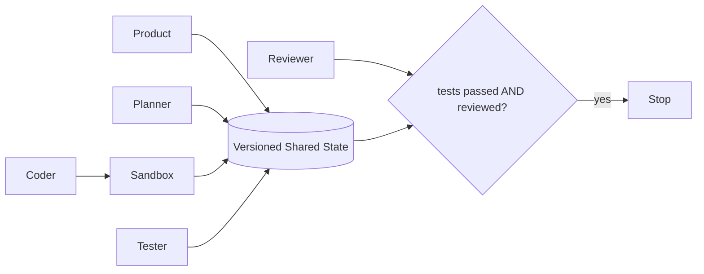

# 项目9：Multi-Agent 软件开发团队

## 需求、架构与数据流
技术选型：Python 3.12、Pydantic 2、FastAPI、pytest 与 Docker；在线供应商通过适配器接入。



实现 Product、Planner、Coder、Reviewer、Tester 五角色的结构化协作。 离线模式使用确定性 Mock，使无 API Key 也能运行和测试；在线服务通过适配器替换，领域结果保持稳定 Schema。

`需求 → Product 验收条件 → Planner 计划 → Coder Artifact → Tester → Reviewer → 硬终止`。所有角色只能通过版本化共享状态通信，独立实现位于 `src/ai_agent_book/apps/multi_agent_team.py`，直接测试位于 `tests/test_multi_agent_team_app.py`。

## 运行、测试与部署
```bash
PYTHONPATH=src .venv/bin/python projects/09-multi-agent-dev-team/main.py
PYTHONPATH=src .venv/bin/python -m pytest tests/test_multi_agent_team_app.py -q
docker build -f projects/09-multi-agent-dev-team/Dockerfile -t ai-agent-book/project-9 .
docker run --rm ai-agent-book/project-9
```

配置只从环境读取，默认 `APP_MODE=offline`。常见问题：角色越多不一定更好，消息与费用均有硬上限。扩展方向：加入共享状态版本、Sandbox 和单 Agent 基线对照。

## 实现说明与验收

`DevelopmentTeam` 包含 Product、Planner、Coder、Tester、Reviewer 五个独立角色，但禁止点对点自由闲聊；Coordinator 校验输出并将共享状态版本递增。消息数与估算 Token 都有硬预算，只有 `tests_passed` 与 `review_approved` 同时成立才成功终止。测试验证角色次序、版本、成本上限和预算提前停止，避免无效对话与死循环。

## 目录、配置与扩展

```text
09-multi-agent-dev-team/  README.md  main.py  .env.example  Dockerfile  tests/
src/ai_agent_book/apps/multi_agent_team.py  # 五角色与 Coordinator
```

默认 Artifact 在内存中生成并由 AST 检查，不执行不可信模型代码。常见问题是不断增加角色却没有独立信息或权限边界。扩展方向包括真正的临时 Git Worktree、容器 Sandbox、补丁应用、pytest Runner，以及与单 Agent 基线的质量/成本对照。
