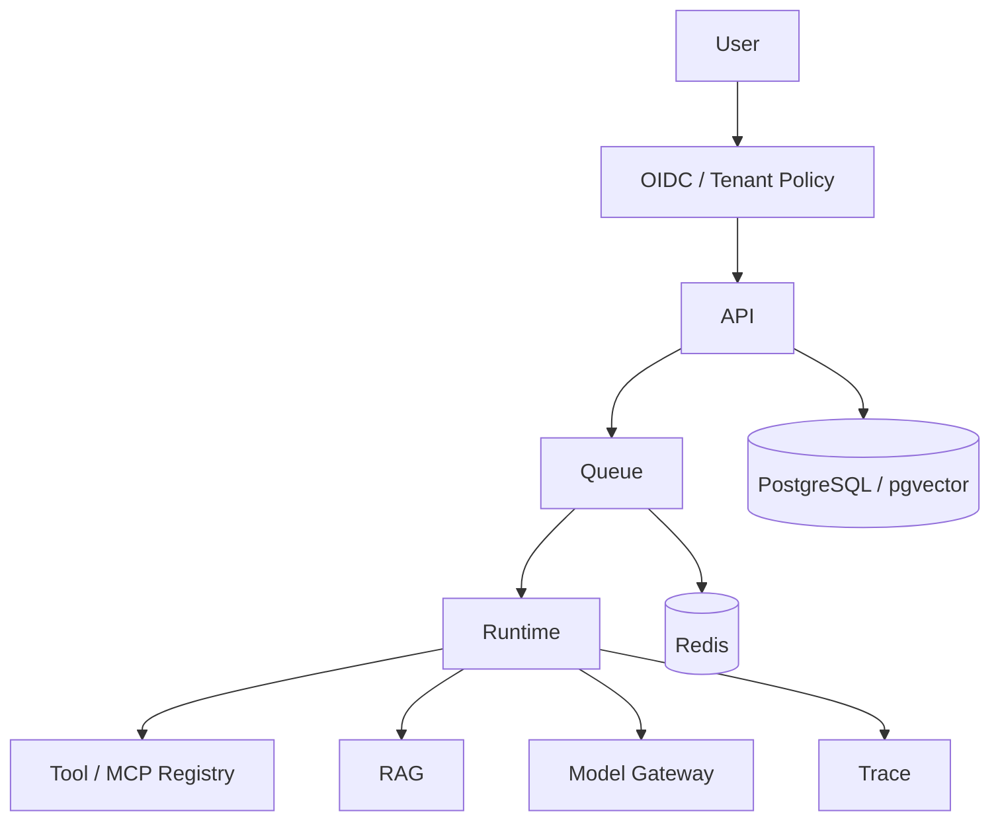
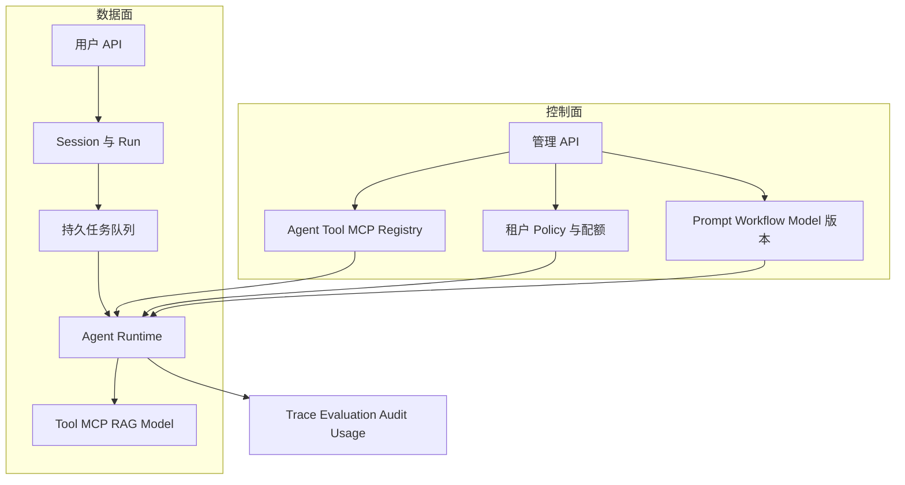
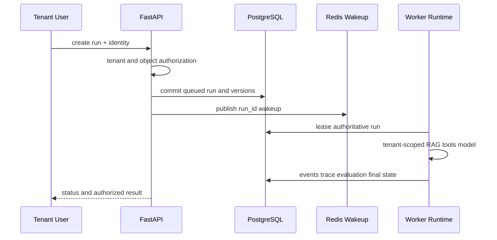
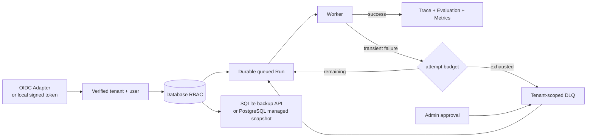

# 项目10：企业级 Agent 平台

## 需求、架构与数据流
技术选型：Python 3.12、Pydantic 2、FastAPI、pytest 与 Docker；在线供应商通过适配器接入。

项目以多租户 Run 为核心纵向切片，将控制面注册、数据面执行、持久队列、RAG、Trace 与 Evaluation 放在同一可验证架构中。



实现多租户、Agent/Tool 注册、MCP/RAG 接口、会话、队列、Trace、Evaluation 与管理接口边界。 离线模式使用确定性 Mock，使无 API Key 也能运行和测试；在线服务通过适配器替换，领域结果保持稳定 Schema。



控制面配置以不可变版本发布，数据面每个 Run 记录实际版本、主体和租户，支持复现、回滚与成本归属。



Redis 只是可恢复唤醒信号，PostgreSQL 是任务事实来源。Worker 扫描 queued 状态可在 Redis 故障后恢复，且所有检索和管理接口强制租户隔离。

`租户/用户 → Agent/Tool/MCP 注册 → Session → 持久任务队列 → Runtime/RAG → Trace → Evaluation → 管理 API`。独立实现位于 `src/ai_agent_book/apps/enterprise_platform.py`，API 入口是 `api.py`，直接测试位于 `tests/test_enterprise_platform_app.py`。

## 运行、测试与部署
```bash
PYTHONPATH=src .venv/bin/python projects/10-enterprise-platform/main.py
PYTHONPATH=src .venv/bin/python -m pytest tests/test_enterprise_platform_app.py -q
docker build -f projects/10-enterprise-platform/Dockerfile -t ai-agent-book/project-10 .
docker run --rm ai-agent-book/project-10
```

完整 Compose 验收命令如下；它会实际创建 Agent、MCP Tool、Session 和 Run，再由 Worker 处理并从管理 API 查询结果：

```bash
docker compose up --build -d
PYTHONPATH=src .venv/bin/python scripts/verify_enterprise_compose.py
docker compose down
```

配置只从环境读取，默认 `APP_MODE=offline`。常见问题：离线纵切面不是完整身份或生产基础设施。扩展方向：加入 FastAPI、PostgreSQL、Redis、pgvector、OIDC 和 Compose。

## 实现说明与验收

`EnterprisePlatform` 通过 SQLAlchemy 在 SQLite 与 PostgreSQL 上使用同一表和事务边界，存储租户、用户、Agent、Tool/MCP、Session、文档、Run、Trace 和 Evaluation。`RedisRunQueue` 提供任务唤醒，Redis 故障时 Worker 扫描数据库 queued 状态恢复，不丢任务。RAG 只在当前租户文档中检索；FastAPI 管理接口区分管理员与成员并拒绝跨租户读取。测试覆盖完整运行、权限、隔离、Redis 故障降级和 API；Compose 三服务健康、纵向验收、PostgreSQL 持久化与 API 重启恢复均已通过。

## 目录、配置与扩展

```text
10-enterprise-platform/  README.md  main.py  api.py  .env.example  Dockerfile  tests/
src/ai_agent_book/apps/enterprise_platform.py  # 数据、队列、权限与 API
docker-compose.yml  # API + PostgreSQL + Redis
```

本地 CLI 默认 SQLite；Compose 使用 `postgresql+psycopg` 和 Redis。Secret 不应采用示例密码进入生产。常见问题是 Redis 入队成功却数据库事务失败，本实现先提交数据库并把 Redis 作为可恢复唤醒信号。扩展方向包括 OIDC、PostgreSQL RLS、独立 Worker、MCP 执行器、pgvector、配额、OpenTelemetry 和迁移工具。

## 身份、失败恢复与备份边界

API 支持两种明确分离的身份模式：未配置 Verifier 时只用于本地教学的租户/用户 Header；配置 `AUTH_HMAC_SECRET` 后只接受短期签名 Bearer Token。`IdentityVerifier` 是生产 OIDC/JWT 适配边界，HMAC 实现仅用于无需外部 IdP 的离线验收，不应冒充 OIDC。



DLQ 只保存错误类型、次数和 Run 引用，不复制 Prompt 或 Secret；管理员重放会清空失败计数。成员只能取消自己的排队任务。`backup.py` 使用 SQLite Online Backup API 生成一致性快照；PostgreSQL 路径明确要求 `pg_dump` 或托管快照，代码不会把文件复制伪装成数据库备份。
