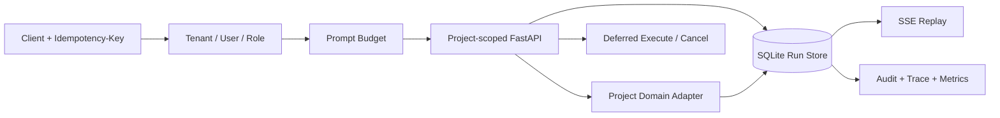

# 十个项目的生产服务契约

项目 1—9 保留各自 CLI 与领域 Adapter，同时通过 `api.py` 暴露统一的生产形态服务边界；项目 10 使用更完整的企业平台 API。共享外壳不是把业务揉成一个应用，而是统一团队必须共同维护的生命周期、权限和证据协议。



每个项目独立选择领域 Adapter 和数据库路径。共享层提供：

- `/health/live` 与 `/health/ready`；
- 带租户、用户、角色和 Prompt 预算的 `/v1/runs`；
- SQLite WAL 持久状态与 Schema Version；
- 幂等创建、显式状态迁移、延迟执行和取消；
- 租户隔离的 Run 查询与 SSE 事件回放；
- 脱敏失败结果、追加式审计、Trace 与 Prometheus 文本指标。

## 本地启动

```bash
PYTHONPATH=src DATABASE_PATH=.data/project-1.db \
  .venv/bin/uvicorn --app-dir projects/01-minimal-assistant api:app --port 8101

curl -X POST http://127.0.0.1:8101/v1/runs \
  -H 'Content-Type: application/json' \
  -H 'X-Tenant-ID: demo' -H 'X-User-ID: learner' \
  -H 'X-Roles: project:run,project:observe' \
  -H 'Idempotency-Key: demo-001' \
  -d '{"prompt":"解释 Agent Runtime"}'
```

## Compose

```bash
docker compose -f projects/docker-compose.yml up --build -d
docker compose -f projects/docker-compose.yml ps
docker compose -f projects/docker-compose.yml down
```

Compose 仅将端口绑定到 `127.0.0.1`，容器删除全部 Linux capabilities、启用只读根文件系统和 `no-new-privileges`，每个项目使用独立持久卷。示例 Header 身份只用于离线教学；公网部署必须由 OIDC/JWT 验证器替换，不能信任客户端自报角色。
